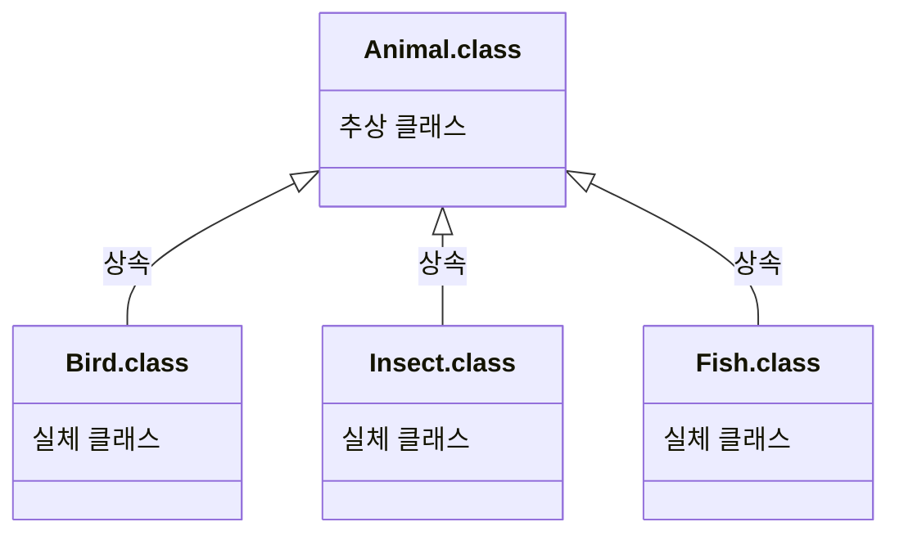

# Part 02 객체 지향 프로그래밍 
## Chapter 07 상속 
### [7.1 상속 개념](#-71-상속-개념)
### [7.2 클래스 상속](#-72-클래스-상속)
### [7.3 부모 생성자 호출](#-73-부모-생성자-호출)
### [7.4 메소드 재정의](#-74-메소드-재정의)
### [7.5 final 클래스의 final 메소드](#-75-final-클래스의-final-메소드)
### [7.6 protected 접근 제한자](#-76-protected-접근-제한자)
### [7.7 타입 변환](#-77-타입-변환)
### [7.8 다형성](#-78-다형성)
### [7.9 객체 타입 확인](#-79-객체-타입-확인)
### [7.10 추상 클래스](#-710-추상-클래스)
### [7.11 봉인된 클래스](#-711-봉인된-클래스) 

## 🔖 7.1 상속 개념
상속은 부모가 자식에게 물려주는 행위를 말함. 부모 클래스의 필드와 메소드를 자식 클래스에게 물려줄 수 있음.

```text
부모클래스 = 필드1 + 메소드1      자식클래스에서
  ⬆︎상속     ⬇︎물려받음⬇     추가한 필드와 메소드
자식클래스 = 필드1 + 메소드1 +   필드2 + 메소드2
```
부모클래스 (A.java)
```java
public class A {
    int field1;
    void method1() { ... }
}
```

자식클래스 (B.java)
```java
public class B extends A {
    String field2;
    void method2() { ... }
}
```
B클래스를 객체 생성해서 다음과 같이 사용할 때 B가 field1과 method1을 가짐
```java
B b = new B();
b.field1 = 10;      // A로부터 물려받은 필드
b.method1();        // A로부터 물려받은 메소드

b.field2 = "홍길동";  // B가 추가한 필드
method2();          // B가 추가한 메소드
```

## 🔖 7.2 클래스 상속
프로그램에서 상속은 자식이 부모를 선택
상속이 결정되면 부모 클래스를 다음과 같이 extends 뒤에 기술
```java
public class 자식클래스 extends 부모클래스 {
}
```
자바에서는 다중상속 허용하지 않음 (아래는 허용되지 않는 코드)
```java
public class 자식클래스 extends 부모클래스, 부모클래스2(x) {
}
```

### 상속 예재
부모클래스
```java
package temp.src.ch07.sec02;

public class Phone {
    public String model;
    public String color;

    public void bell() {
        System.out.println("벨이 울립니다.");
    }

    public void sendVoice(String message) {
        System.out.println("자기: " + message);
    }

    public void receiveVoice(String message) {
        System.out.println("상대방: " + message);
    }

    public void hangUp() {
        System.out.println("전화를 끊습니다.");
    }

}
```
자식클래스
```java
package temp.src.ch07.sec02;

public class SmartPhone extends Phone {
    public boolean wifi;

    public SmartPhone(String model, String color) {
        this.model = model;
        this.color = color;
    }

    public void setWifi(boolean wifi) {
        this.wifi = wifi;
        System.out.println("와이파이 상태를 변경했습니다.");
    }

    public void internet() {
        System.out.println("인터넷에 연결합니다.");
    }
}
```
상속클래스 실행
```java
package temp.src.ch07.sec02;

public class SmartPhoneExample {
    public static void main(String[] args) {
        //SmartPhone 객체 생성
        SmartPhone myPhone = new SmartPhone("갤럭시", "은색");

        //Phone으로부터 상속받은 필드 읽기
        System.out.println("모델: " + myPhone.model);
        System.out.println("색상: " + myPhone.color);

        //SmartPhone의 필드 읽기
        System.out.println("와이파이 상태: " + myPhone.wifi);

        //Phone으로부터 상속받은 메소드 호출
        myPhone.bell();
        myPhone.sendVoice("여보세요.");
        myPhone.receiveVoice("안녕하세요! 저는 홍길동인데요.");
        myPhone.sendVoice("아~ 네, 반갑습니다.");
        myPhone.hangUp();

        //SmartPhone의 메소드 호출
        myPhone.setWifi(true);
        myPhone.internet();
    }
}
```
```shell
#실행결과
모델: 갤럭시
색상: 은색
와이파이 상태: false
벨이 울립니다.
자기: 여보세요.
상대방: 안녕하세요! 저는 홍길동인데요.
자기: 아~ 네, 반갑습니다.
전화를 끊습니다.
와이파이 상태를 변경했습니다.
인터넷에 연결합니다.
```

## 🔖 7.3 부모 생성자 호출
현실에서 부모 없는 자식이 있을 수 없듯이 자바에서도 자식 객체를 생성하면 부모 객체가 먼저 생성된 다음에 자식 객체가 생성
> 자식클래스 변수 = new 자식클래스( );  

모든 객체는 생성자를 호출해야만 생성되고 부모 객체도 예외는 아님. 자식 객체 생성자에는 맨 첫 줄에 숨겨져 있는 super()에 의해 부모 객체 생성자를 호출
```java
//자식 생성자 선언
public 자식클래스(...) {
    super();
    ...
}
```
부모 클래스에 기본 생성자가 없고 매개변수를 갖는 생성자만 있다면 직접 super(매개값, ...) 코드 작성, 매개값의 타입과 개수가 일치하는 부모 생성자를 호출
```java
//자식 생성자 선언
public 자식클래스(...) {
    super(매개값, ...);
    ...
}
```
### p291. 부모생성자 호출 예재
```java
package temp.src.ch07.sec03.exam02;

public class Phone {
    public String model;
    public String color;

    public Phone(String model, String color) {
        this.model = model;
        this.color = color;
        System.out.println("Phone(String model, String color) 생성자 실행");
    }
}
```
```java
package temp.src.ch07.sec03.exam02;

public class SmartPhone extends Phone {

    public SmartPhone(String model, String color) {
        super(model, color);
        System.out.println("SmartPhone(String model, String color) 생성자 실행");
    }
}
```
```java
package temp.src.ch07.sec03.exam02;

public class SmartPhoneExample {
    public static void main(String[] args) {
        //SmartPhone 객체 생성
        SmartPhone myPhone = new SmartPhone("갤럭시", "은색");

        //Phone으로부터 상속받은 필드 읽기
        System.out.println("모델: " + myPhone.model);
        System.out.println("색상: " + myPhone.color);
    }
}
```
```shell
#실행결과
Phone(String model, String color) 생성자 실행
SmartPhone(String model, String color) 생성자 실행
모델: 갤럭시
색상: 은색
```

## 🔖 7.4 메소드 재정의
자식 클래스에서 부모 클래스의 매소드를 재정의해서 사용하는걸 메소드 오버라이딩(Overriding) 이라 함
### 메소드 오버라이딩
```java
class Parent {
    void method1() { ... }
    void method2() { ... }
}
class Child extends Parent {
    void method2() { ... } //method2 - method overriding
    void method3() { ... }
}
```
> - 부모 메소드의 선언부(리턴 타입, 메소드 이름, 매개변수)와 동일해야 한다.
> - 접근 제한을 더 강하게 오버라이딩할 수 없다(public -> private 변경불가)
> - 새로운 예외를 throws 할 수 없다
### p294. ComputerExample.java 예재 (Method Overriding)
```java
package temp.src.ch07.sec04.exam01;

public class Calculator {
    public double areaCircle(double r) {
        System.out.println("Calculator 객체의 areaCircle() 실행");
        return 3.14159 * r * r;
    }
}
```
```java
package temp.src.ch07.sec04.exam01;

public class Computer extends Calculator {
    @Override //컴파일 시 정확히 오버라이딩이 되었는지 체크해 줌(생략가능)
    public double areaCircle(double r) {
        System.out.println("Computer 객체의 areaCircle() 실행");
        return Math.PI * r * r;
    }
}
```
```java
package temp.src.ch07.sec04.exam01;

public class ComputerExample {
    public static void main(String[] args) {
        int r = 10;

        Calculator calculator = new Calculator();
        System.out.println("원 면적: " + calculator.areaCircle(r));
        System.out.println();


        Computer computer = new Computer();
        System.out.println("원 면적: " + computer.areaCircle(r));
    }
}
```
```shell
#실행결과
Calculator 객체의 areaCircle() 실행
원 면적: 314.159

Computer 객체의 areaCircle() 실행
원 면적: 314.1592653589793
```
> *@Override 를 붙이면 컴파일 단계에서 정확히 오버라이딩 되었는지 체크하고 이상있을경우 컴파일 에러를 출력*

### 부모 메소드 호출
메소드 재정의 시 부모 메소드의 일부만 변경된닫 하더라도 중복된 내용을 자식 메소드도 가지고 있어야하는데 예를들어 1줄의 추가 코드가 필요할때도 부모 메소드 전체를 작성 후 추가 코드 1줄을 작성하는게 비효율적이기 때문에 자식에서도 메소드 내에서 super 키워드와 도트(.) 연산자를 사용하여 부모 메소드를 호출 할 수 있다.  

부모 클래스
```java
class Parent {
    public void method() {
        //작업 처리1
    }
}
```
자식 클래스
```java
class Child extends Parent {
    @Override
    public void method() {
        super.method(); //부모 메소드 호출
        //작업 처리2
    }
}
```
### p297. SupersonicAirplaneExample.java 예재
```java
package temp.src.ch07.sec04.exam02.exam01;

public class Airplane {
    public void land() {
        System.out.println("착륙합니다.");
    }

    public void fly() {
        System.out.println("일반 비행합니다.");
    }

    public void takeOff() {
        System.out.println("이륙합니다.");
    }
}
```
```java
package temp.src.ch07.sec04.exam02.exam01;

public class SupersonicAirplane extends Airplane {
    public static final int NORMAL = 1;
    public static final int SUPERSONIC = 2;
    public int flyMode = NORMAL;

    @Override
    public void fly() {
        if(flyMode == SUPERSONIC) {
            System.out.println("초음속 비행합니다.");
        } else {
            //Airplane 객체의 fly() 메소드 호출
            super.fly();
        }
    }
}
```
```java
package temp.src.ch07.sec04.exam02.exam01;

public class SupersonicAirplaneExample {
    public static void main(String[] args) {
        SupersonicAirplane sa = new SupersonicAirplane();
        sa.takeOff();
        sa.fly();
        sa.flyMode = SupersonicAirplane.SUPERSONIC;
        sa.fly();
        sa.flyMode = SupersonicAirplane.NORMAL;
        sa.fly();
        sa.land();
    }
}
```
```shell
#실행결과
이륙합니다.
일반 비행합니다.
초음속 비행합니다.
일반 비행합니다.
착륙합니다.
```

## 🔖 7.5 final 클래스의 final 메소드
### final 클래스
클래스 선언 시 final 키워드를 class 앞에 붙이면 최종적인 클래스로 상속 불가
> public final class 클래스 { ... }  

대표적인 예가 String 클래스 (String 클래스의 자식 클래스 생성 불가)
> public final class String { ... }

### final 메소드
메소드 선언 시 final 키워드를 붙이면 오버라이딩 할 수 없는 메소드가 됨 (자식 클래스에서 final 메소드 재정의 불가)
> public final 리턴타입 메소드( 매개변수, ... ) { ... }  
### p300. SportsCar.java 예재 (final 메소드 Overriding 불가)
```java
package temp.src.ch07.sec05.exam02;

public class Car {
    public int speed;
    public void speedUp() {
        speed += 1;
    }

    public final void stop() {
        System.out.println("차를 멈춤");
        speed = 0;
    }
}
```
```java
package temp.src.ch07.sec05.exam02;

public class SportsCar extends Car{
    @Override
    public void speedUp() {
        speed += 10;
    }

    //오버라이딩을 할 수 없음
    @Override 
    public void stop() {
        System.out.println("스포츠카를 멈춤");
        speed = 0;
    }
}
``` 

## 🔖 7.6 protected 접근 제한자
> public > protected > default > private 순으로 접근 제한이 강화

|접근 제한자|접근 대상| 제한 범위                   |
|---|---|-------------------------|
|protected|필드, 생성자, 메소드| 갘은 패키지이거나, 자식 객체만 사용 가능 |
protected는 같은 패키지에서는 default처럼 접근 가능, 다른 패키지에서는 자식 클래스만 접근 허용, protected는 필드와 생성자 그리고 메소드 선언에서 사용
### p302. protected 접근 제한자 설정 후 패키지 간 사용 예제
```java
package temp.src.ch07.sec06.package1;

public class A {
    //필드 선언
    protected String field;

    //생성자 선언
    protected A() {
    }

    //메소드 선언
    protected void method() {
    }
}
```
```java
package temp.src.ch07.sec06.package1;

public class B {

    //메소드 선언
    public void method() {
        A a = new A();      //O
        a.field = "value";  //O
        a.method();         //O
    }
}
```
```java
package temp.src.ch07.sec06.package2;

import temp.src.ch07.sec06.package1.A;

public class C {

    //메소드 선언
    public void method() {
        A a = new A();      //X
        a.field = "value";  //X
        a.method();         //X
    }
}
```
```java
package temp.src.ch07.sec06.package2;

import temp.src.ch07.sec06.package1.A;

public class D extends A{
    //생성자 선언
    public D() {
        //A() 생성자 호출
        super();                //O
    }
    
    //메소드 선언
    public void method1() {
        //A 필드값 변경
        this.field = "value";   //O
        //A 메소드 호출
        this.method();          //O
    }
    
    //메소드 선언
    public void method2() {
        A a = new A();          //X
        a.field = "value";      //X
        a.method();             //X
    }
}
```

## 🔖 7.7 타입 변환
타입 변환이란 타입을 다른 타입으로 변환하는 것을 말함.  
클래스는 상속 관계에 있는 클래스 사이에서 가능
### 자동 타입 변환
자동 타입 변환(Promotion)은 의미 그대로 자동적으로 타입 변환이 일어나는 것을 말함. 자동 타입 변환의 조건
> 부모타입 변수 = 자식타입객체;

Animal 클래스(부모)
```java
class Animal {
    ...
}
```
Cat 클래스(자식)
```java
class Cat extends Animal {
    ...
}
```
```java
Cat cat = new Cat();
Animal animal = cat; //Animal animal - new Cat(); 도 가능
```
스택(stack) 영역

| 변수     | 참조 메모리주소   |
|--------|------------|
| cat    | 0x42AB4F50 |
| animal | 0x42AB4F50 |


힙(heap) 영역

| 메모리주소      | 데이터       |
|------------|-----------|
| 0x42AB4F50 | Cat 객체    |
| 0x56ACB12F | Animal 객체 |

두 참조 변수의 == 연산 결과는 true가 나옴
```java
cat == animal     //true
```
> 상속관계 부모부터 자식 순으로 아래와 같을때
> - A(부모) > B(부모,자식) > D(자식)
> - A(부모) > C(부모,자식) > E(자식)
```java
B b = new B();
C c = new C();
D d = new D();
E e = new E();
```
```java
A a1 = b;   //(가능)
A a2 = c;   //(가능)
A a3 = d;   //(가능)
A a4 = e;   //(가능)
        
B b1 = d;   //(가능)
C c1 = e;   //(가능)

B b2 = e;   //(불가능)
C c2 = d;   //(불가능)
```
### p308. 자동 타입 변환 예제
```java
package temp.src.ch07.sec07.exam02;

public class Parent {
    public void method1() {
        System.out.println("Parent-method1()");
    }

    public void method2() {
        System.out.println("Parent-method2()");
    }
}
```
```java
package temp.src.ch07.sec07.exam02;

public class Child extends Parent {
    @Override
    public void method2() {
        System.out.println("Child-method2()");
    }

    public void method3() {
        System.out.println("Child-method3()");
    }
}
```
```java
package temp.src.ch07.sec07.exam02;

public class ChildExample {
    public static void main(String[] args) {
        //자식 객체 생성
        Child child = new Child();

        //자동 타입 변환
        Parent parent = child;

        //메소드 호출
        parent.method1();
        parent.method2();
        //parent.method3(); (호출 불가능)
    }
}
```
```shell
#실행결과
Parent-method1()
Child-method2()
```
### 강제 타입 변환
> 자식타입 변수 = (자식타입) 부모타입객체;
```java
Parent parent = new Child();    //자동 타입 변환
Child child = (Child) parent;   //강제 타입 변환
```
### p311. 강제 타입 변환 예제
```java
package temp.src.ch07.sec07.exam03;

public class Parent {
    public String field1;

    public void method1() {
        System.out.println("Parent-method1()");
    }

    public void method2() {
        System.out.println("Parent-method2()");
    }
}
```

```java
package temp.src.ch07.sec07.exam03;

import temp.src.ch07.sec07.exam03.Parent;

public class Child extends Parent {
    public String field2;

    public void method3() {
        System.out.println("Child-method3()");
    }
}
```

```java
package temp.src.ch07.sec07.exam03;

import temp.src.ch07.sec07.exam03.Child;
import temp.src.ch07.sec07.exam03.Parent;

public class ChildExample {
    public static void main(String[] args) {
        //객체 생성 및 자동 타입 변환
        Parent parent = new Child();

        //Parent 타입으로 필드와 메소드 사용
        parent.field1 = "data1";
        parent.method1();
        parent.method2();
        /*
        parent.field2 = "data2";    //(불가능)
        parent.method3();           //(불가능)
         */

        //강제 타입 변환
        Child child = (Child) parent;

        //Child 타입으로 필드와 메소드 사용
        child.field2 = "data2";    //(가능)
        child.method3();           //(가능)
    }
}
```
```shell
#실행결과
Parent-method1()
Parent-method2()
Child-method3()
```

## 🔖 7.8 다형성
다형성이란 사용 방법은 동일하지만 실행 결과가 다양하게 나오는 성질  
ex) 프로그램을 구성하는 개체를 바꾸면 프로그램의 실행 성능이 다름

### 필드 다형성
필드 다형성은 필드 타입은 동일하지만 대입되는 객체가 달라져서 실행 결과가 다양하게 나올 수 있는 것을 의미
```java
package temp.src.ch07.sec08.exam01;

public class Tire {
    public void roll() {
        System.out.println("회전합니다.");
    }
}
```
```java
package temp.src.ch07.sec08.exam01;

public class HankookTire extends Tire {
    @Override
    public void roll() {
        System.out.println("한국 타이어가 회전합니다.");
    }
}
```
```java
package temp.src.ch07.sec08.exam01;

public class KumhoTire extends Tire {
    @Override
    public void roll() {
        System.out.println("금호 타이어가 회전합니다.");
    }
}
```
```java
package temp.src.ch07.sec08.exam01;

public class Car {
    public Tire tire;

    public void run() {
        tire.roll();
    }
}
```
```java
package temp.src.ch07.sec08.exam01;

public class CarExample {
    public static void main(String[] args) {
        Car myCar = new Car();

        //Tire 객체 생성
        myCar.tire = new Tire();
        myCar.run();

        //HankookTire 객체 생성
        myCar.tire = new HankookTire();
        myCar.run();

        //KumhoTire 객체 생성
        myCar.tire = new KumhoTire();
        myCar.run();
    }
}
```
```shell
#실행결과
회전합니다.
한국 타이어가 회전합니다.
금호 타이어가 회전합니다.
```
### 매개변수 다형성
다형성은 필드보다는 메소드를 호출할 때 많이 발생  
메소드가 클래스 타입의 매개변수를 가지고 있을 경우, 호출할 때 동일한 타입의 객체를 제공하는 것이 정석이지만 자식 객체도 가능
```java
public class Driver {
    public void drive(Vehicle vehicle) {
        vehicle.run();
    }
}
```
```java
Driver driver = new Driver();
Vehicle vehicle = new Vehicle();
driver.drive(vehicle);  //Vehicle 객체의 run() 호출
```
```java
Driver driver = new Driver();
Bus bus = new Bus();
driver.drive(bus);      //Bus 객체의 run() 호출
```

## 🔖 7.9 객체 타입 확인
매개변수의 다형성에서 실제로 어떤 객체가 매개값으로 제공되었는지 확인하는 방법  
매개변수가 아니더라도 변수가 참조하는 객체의 타입을 확인하고자 할때, instanceof 연산자를 사용
```java
boolean result = 객체 instanceof 타입;
```
### 객체 타입 확인 예제
```java
package temp.src.ch07.sec09;

public class Person {
    public String name;
    public Person(String name) {
        this.name = name;
    }

    public void walk() {
        System.out.println("걷습니다.");
    }
}
```
```java
package temp.src.ch07.sec09;

public class Student extends Person {
    public int studentNo;
    public Student(String name, int studentNo) {
        super(name);
        this.studentNo = studentNo;
    }

    public void study() {
        System.out.println("공부를 합니다.");
    }
}
```
```java
package temp.src.ch07.sec09;

public class InstanceofExample {
    public static void personInfo(Person person) {
        System.out.println("name: " + person.name);
        person.walk();
        
        //매개값이 Student인 경우에만 강제 타입 변환해서 studentNo필드와 study() 메소드 사용
        /*if (person instanceof Student) {
            Student student = (Student) person;
            System.out.println("studentNo: " + student.studentNo);
            student.study();
        }*/
        
        //Java 12부터 사용 가능
        if(person instanceof Student student) {
            System.out.println("studentNo: " + student.studentNo);
            student.study();
        }
    }
    
    public static void main(String[] args) {
        Person p1 = new Person("홍길동");
        personInfo(p1);

        System.out.println();
        
        Person p2 = new Student("김길동", 10);
        personInfo(p2);
    }
}
```
```shell
#실행결과
name: 홍길동
걷습니다.

name: 김길동
걷습니다.
studentNo: 10
공부를 합니다.
```

## 🔖 7.10 추상 클래스
사전적 의미로 추상은 실체 간에 공통되는 특성을 추출한 것을 말함  
예를 들면 새, 곤충, 물고기 등의 공통점은 동물 (동물은 실체들의 공통되는 특성을 가지고 있는 추상적인 것)

추상 클래스는 실체 클래스의 공통되는 필드와 메소드를 추출해서 만들었기 때문에 new 를 이용한 객체 직접 생성 불가
```java
Animal animal = new Animal()      //X
```
추상 클래스는 새로운 실체 클래스를 만들기 위한 부모 클래스로만 사용
```java
class Fish extends Animal {
    ...
}
```
### 추상 클래스 선언
클래스 선언에 abstract 키워드를 붙이면 추상 클래스 선언
```java
public abstract class 클래스명 {
    //필드
    //생성자
    //메소드
}
```
### p325. 추상 클래스 사용 예제
```java
package temp.src.ch07.sec10.exam01;

public abstract class Phone {
    String owner;

    Phone(String owner) {
        this.owner = owner;
    }

    void turnOn() {
        System.out.println("폰 전원을 켭니다.");
    }

    void turnOff() {
        System.out.println("폰 전원을 끕니다.");
    }
}
```
```java
package temp.src.ch07.sec10.exam01;

public class SmartPhone extends Phone {
    SmartPhone(String owner) {
        super(owner);
    }

    void internetSearch() {
        System.out.println("인터넷 검색을 합니다.");
    }
}
```
```java
package temp.src.ch07.sec10.exam01;

public class PhoneExample {
    public static void main(String[] args) {
        SmartPhone smartPhone = new SmartPhone("홍길동");

        smartPhone.turnOn();
        smartPhone.internetSearch();
        smartPhone.turnOff();
    }
}
```
```shell
#실행결과
폰 전원을 켭니다.
인터넷 검색을 합니다.
폰 전원을 끕니다.
```

### 추상 메소드와 재정의
자식 클래스들이 가지고 있는 공통 메소드를 뽑아내어 추상 클래스로 작성할 때, 메소드 선언부(리턴타입, 메소드명, 매개변수)만 동일하고 실행 내용은 자식 클래스마다 달라야 하는 경우 사용
```java
abstract 리턴타입 메소드명(매개변수, ...);
```
### p328. AbstractMethodExample.java 예제
```java
package temp.src.ch07.sec10.exam02;

public abstract class Animal {
    public void breathe() {
        System.out.println("숨을 쉽니다.");
    }

    //추상 메소드 선언
    public abstract void sound();
}
```
```java
package temp.src.ch07.sec10.exam02;

public class Dog extends Animal {
    //추상 메소드 재정의
    @Override
    public void sound() {
        System.out.println("멍멍");
    }
}
```
```java
package temp.src.ch07.sec10.exam02;

public class Cat extends Animal {
    //추상 메소드 재정의
    @Override
    public void sound() {
        System.out.println("야옹");
    }
}
```
```java
package temp.src.ch07.sec10.exam02;

public class AbstractMethodExample {
    public static void main(String[] args) {
        Dog dog = new Dog();
        dog.sound();

        Cat cat = new Cat();
        cat.sound();

        animalSound(new Dog());
        animalSound(new Cat());
    }

    //자동 타입변환 후 재정의된 메소드 호출
    public static void animalSound(Animal animal) {
        animal.sound();
    }
}
```
```shell
#실행결과
멍멍
야옹
멍멍
야옹
```

## 🔖 7.11 봉인된 클래스
기본적으로 final 클래스를 제외한 모든 클래스는 부모 클래스가 될 수 있다.  
Java 15부터는 부분별한 자식 클래스 생성을 방지하기 위해 봉인된(sealed) 클래스가 도입
```java
public sealed class Person  permits Employee, Manager { ... }
```
* sealed 키워드를 사용하면 permits 키워드 뒤에 상속 가능한 자식 클래스를 지정해야함
```java
public final class Employee extends Person { ... }
public non-sealed class Manager extends Person { ... }
```
- *final : 더이상 상속 불가*
- *non-sealed : 봉인을 해제한다는 뜻*

### p331. SealedExample.java 예제
```java
package temp.src.ch07.sec11;

public sealed class Person permits Employee, Manager{
    public String name;

    public void work() {
        System.out.println("하는 일이 결정되지 않았습니다.");
    }
}
```
```java
package temp.src.ch07.sec11;

public final class Employee extends Person {
    @Override
    public void work() {
        System.out.println("제품을 생산합니다.");
    }
}
```
```java
package temp.src.ch07.sec11;

public non-sealed class Manager extends Person {
    @Override
    public void work() {
        System.out.println("생산 관리를 합니다.");
    }
}
```
```java
package temp.src.ch07.sec11;

public class SealedExample {
    public static void main(String[] args) {
        Person p = new Person();
        Employee e = new Employee();
        Manager m = new Manager();
        Director d = new Director();

        p.work();
        e.work();
        m.work();
        d.work();
    }
}
```
```shell
#실행결과
하는 일이 결정되지 않았습니다.
제품을 생산합니다.
생산 관리를 합니다.
제품을 기획합니다.
```
