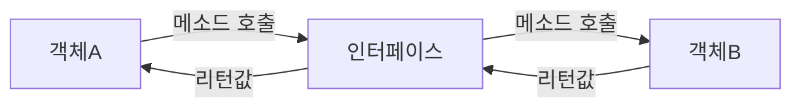
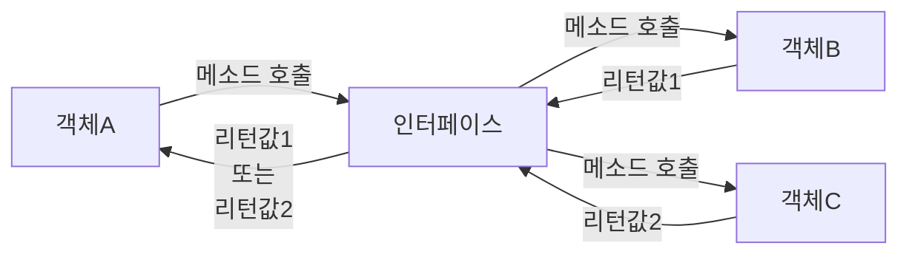
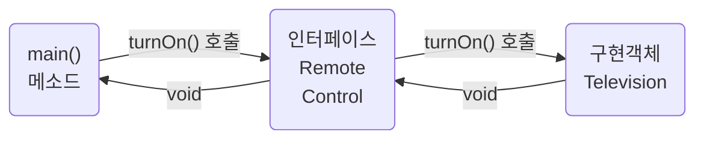
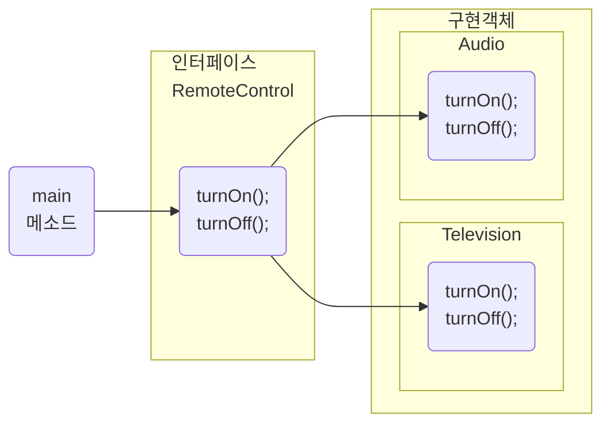
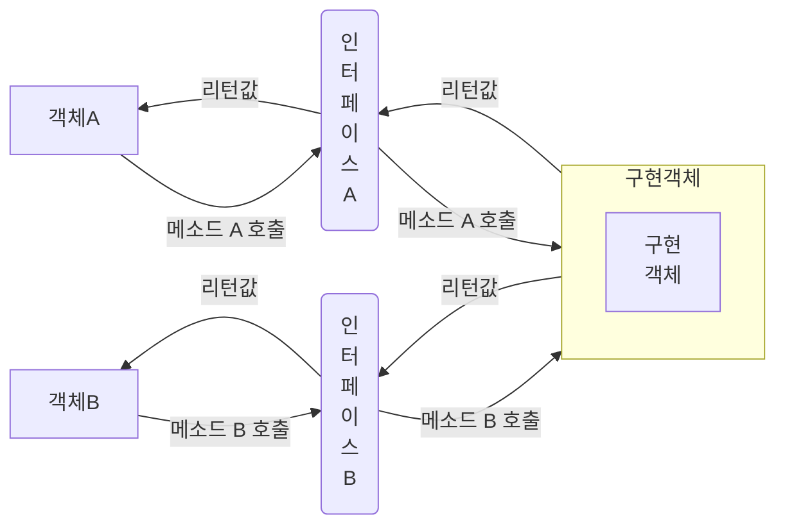
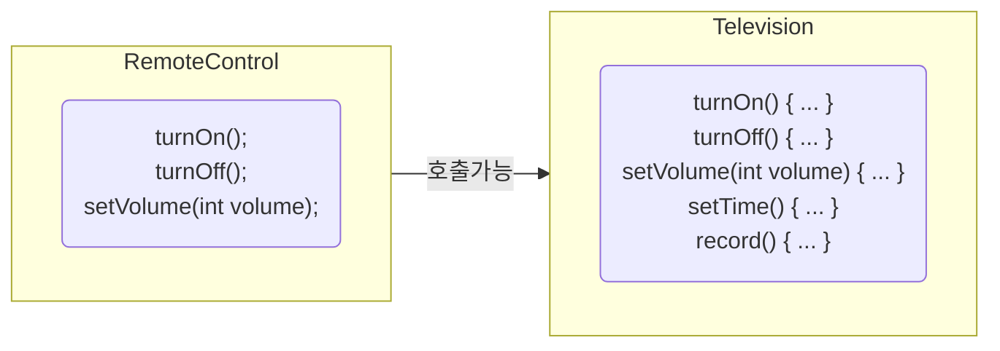
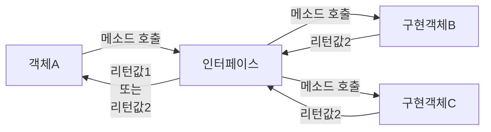
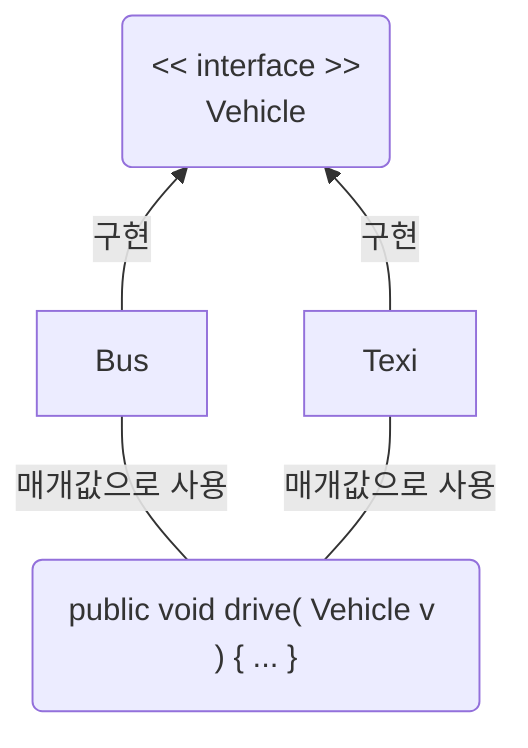
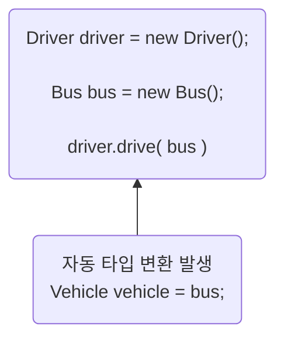

# Part 02 객체 지향 프로그래밍 
## Chapter 08 인터페이스 
### [8.1 인터페이스 역할](#-81-인터페이스-역할)
### [8.2 인터페이스와 구현 클래스 선언](#-82-인터페이스와-구현-클래스-선언)
### [8.3 상수 필드](#-83-상수-필드)
### [8.4 추상 메소드](#-84-추상-메소드)
### [8.5 디폴트 메소드](#-85-디폴트-메소드)
### [8.6 정적 메소드](#-86-정적-메소드)
### [8.7 private 메소드](#-87-private-메소드)
### [8.8 다중 인터페이스 구현](#-88-다중-인터페이스-구현)
### [8.9 인터페이스 상속](#-89-인터페이스-상속)
### [8.10 타입 변환](#-810-타입-변환)
### [8.11 다형성](#-811-다형성)
### [8.12 객체 타입 확인](#-812-객체-타입-확인)
### [8.13 봉인된 인터페이스](#-813-봉인된-인터페이스)

## 🔖 8.1 인터페이스 역할
인터페이스(interface)는 두 장치를 연결하는 접속기를 말함.  
다음 그림과 같이 객체A는 인터페이스를 통해 객체B를 사용할 수 있음

다음 그림처럼 객체B 가 객체C 로 교체 된다고 가정하면  
객체A는 인터페이스 메소드만 사용하므로 객체B, 객체C 변경에 자유롭다.

>위 특징으로 인터페이스는 다형성 구현에 주된 기술로 이용

## 🔖 8.2 인터페이스와 구현 클래스 선언
인터페이스는 `~.java` 의 형태로 작성되고 `~.class` 형태로 컴파일 되기 때문에 물리적 형태는 클래스와 동일  
단 소스를 작성할 때 선언하는 방법과 구성 멤버가 클래스와 다름
### 인터페이스 선언
- default : 같은 패키지에서 사용 가능
- public : 패키지와 상관없이 사용 가능
```java
interface 인터페이스명 {...}              //default 접근 제한
public interface 인터페이스명 {...}       //public 접근 제한
```
중괄호 안에 인터페이스가 가지는 멤버들을 선언 가능
```java
public interface 인터페이스명 {
    //public 상수 필드
    //public 추상 메소드
    //public 디폴트 메소드
    //public 정적 메소드
    //private 메소드
    //private 정적 메소드
}
```
추상 메소드란 선언부만 있고 실행부에 중괄호가 없는 메소드를 말함
```java
package temp.src.ch08.sec02;

public interface RemoteControl {
    //public 추상 메소드
    public void turnOn();
}
```
### 구현 클래스 선언

```java
public class B implements 인터페이스명 { ... }
```

```java
package temp.src.ch08.sec02;

public class Television implements RemoteControl{
    @Override
    public void turnOn() { // 인터페이스에 선언된 turnOn() 추상 메소드 재정의
        System.out.println("TV를 켭니다.");
    }
}
```
### 변수 선언과 구현 객체 대입
- 인터페이스도 하나의 타입으로 사용 가능  
- 인터페이스는 참조 타입에 속하고 객체를 참조하고 있지 않다는 뜻으로 null 대입 가능
```java
RemoteControl rc;
RemoteControl rc = null;
```
- 인터페이스 통해 객체를 사용하기 위해선 인터페이스 변수에 구현 객체를 대입해야함
- 인터페이스 변수를 통해 `turnOn()` 메소드가 호출되면 `Television` 에서 재정의된 `turnOn()` 메소드 실행
```java
rc = new Television();

rc.turnOn();
```
```java
package temp.src.ch08.sec02;

public class Audio implements RemoteControl {
    @Override
    public void turnOn() {
        System.out.println("Audio를 켭니다.");
    }
}
```
```java
package temp.src.ch08.sec02;

public class RemoteControlExample {
    public static void main(String[] args) {
        RemoteControl rc;

        rc = new Television();
        rc.turnOn();

        rc = new Audio();
        rc.turnOn();
    }
}
```
```shell
#실행결과
TV를 켭니다.
Audio를 켭니다.
```

## 🔖 8.3 상수 필드
- 인터페이스는 public static final 특성을 갖는 불변의 상수 필드를 멤버로 가질 수 있음  
- 인터페이스에 선언된 필드는 모두 public static final 특성을 갖기 때문에 public static final 을 생략하더라도 자동적으로 컴파일 과정에서 붙음
- 서로 다른 단어로 구성되어 있을 경우 언더바(_)로 연결하는 것이 관례
```java
package temp.src.ch08.sec03;

public interface RemoteControl {
    int MAX_VOLUME = 10;
    int MIN_VOLUME = 0;
}
```
인터페이스 상수는 구현 객체와 관련 없는 인터페이스 소속 멤버이므로 다음과 같이 인터페이스로 바로 접근해서 상수 값을 사용 가능
```java
package temp.src.ch08.sec03;

public class RemoteControlExample {
    public static void main(String[] args) {
        System.out.println("리모콘 최대 볼륨: " + RemoteControl.MAX_VOLUME);
        System.out.println("리모콘 최저 볼륨: " + RemoteControl.MIN_VOLUME);
    }
}
```
```shell
#실행결과
리모콘 최대 볼륨: 10
리모콘 최저 볼륨: 0
```

## 🔖 8.4 추상 메소드
- 인터페이스 구현 클래스가 재정의해야 하는 public 추상 메소드(abstract method)를 멤버로 가질 수 있음  
- 추상 메소드는 리턴 타입, 메소드명, 매개변수만 기술되고 중괄호 `{}`를 붙이지 않는 메소드를 말함
- public abstract 를 생략하더라도 컴파일 과정에서 자동을 붙음
```java
[ public abstract ] 리턴타입 메소드명(매개변수, ...);
```

```java
package temp.src.ch08.sec04;

public interface RemoteControl {
    int MAX_VOLUME = 10;
    int MIN_VOLUME = 0;

    void turnOn();
    void turnOff();
    void setVolume(int volume);
}
```
```java
package temp.src.ch08.sec04;

public class Television implements RemoteControl {
    private int volume;

    @Override
    public void turnOn() {
        System.out.println("TV를 켭니다.");
    }

    @Override
    public void turnOff() {
        System.out.println("TV를 끕니다.");
    }

    @Override
    public void setVolume(int volume) {
        if(volume>RemoteControl.MAX_VOLUME) {
            this.volume = RemoteControl.MAX_VOLUME;
        } else if(volume<RemoteControl.MIN_VOLUME) {
            this.volume = RemoteControl.MIN_VOLUME;
        } else {
            this.volume = volume;
        }
        System.out.println("현재 TV 볼륨: " + this.volume);
    }
}
```
```java
package temp.src.ch08.sec04;

public class Audio implements RemoteControl {
    private int volume;

    @Override
    public void turnOn() {
        System.out.println("Audio를 켭니다.");
    }

    @Override
    public void turnOff() {
        System.out.println("Audio를 끕니다.");
    }

    @Override
    public void setVolume(int volume) {
        if(volume>RemoteControl.MAX_VOLUME) {
            this.volume = RemoteControl.MAX_VOLUME;
        } else if(volume<RemoteControl.MIN_VOLUME) {
            this.volume = RemoteControl.MIN_VOLUME;
        } else {
            this.volume = volume;
        }
        System.out.println("현재 Audio 볼륨: " + this.volume);
    }
}
```
구현 클래스에서 추상 메소드를 재정의할 때 주의할 점은 인터페이스에서 추상 메소드는 기본적으로 public 접근 제한을 갖기 때문에 public보다 더 낮은 접근 제한으로 재정의 할 수 없으므로 재정의 메소드는 모두 public 이 추가된다.
```java
package temp.src.ch08.sec04;

public class RemoteControlExample {
    public static void main(String[] args) {
        RemoteControl rc;

        rc = new Television();
        rc.turnOn();
        rc.setVolume(5);
        rc.turnOff();

        rc = new Audio();
        rc.turnOn();
        rc.setVolume(5);
        rc.turnOff();
    }
}
```
```shell
#실행결과
TV를 켭니다.
현재 TV 볼륨: 5
TV를 끕니다.
Audio를 켭니다.
현재 Audio 볼륨: 5
Audio를 끕니다.
```

## 🔖 8.5 디폴트 메소드
- 인터페이스에는 완전한 실행 코드를 가진 디폴트 메소드를 선언할 수 있음
- 추상 메소드는 실행부(중괄호)가 없지만, 디폴트 메소드는 실행부가 있음.
- 선언 방법은 클래스 메소드와 동일한데, 차이점은 default 키워드가 리턴 타입 앞에 붙음
```java
[public] default 리턴타입 메소드명(매개변수, ...) { ... }
```
```java
package temp.src.ch08.sec05;

public interface RemoteControl {
    int MAX_VOLUME = 10;
    int MIN_VOLUME = 0;

    void turnOn();
    void turnOff();
    void setVolume(int volume);

    default void setMute(boolean mute) {
        if(mute) {
            System.out.println("무음 처리합니다.");
            setVolume(MIN_VOLUME);
        } else {
            System.out.println("무음 해제합니다.");
        }
    }
}
```
```java
package temp.src.ch08.sec05;

public class RemoteControlExample {
    public static void main(String[] args) {
        RemoteControl rc;

        rc = new Television();
        rc.turnOn();
        rc.setVolume(5);

        rc.setMute(true);
        rc.setMute(false);
    }
}
```
```shell
#실행결과
TV를 켭니다.
현재 TV 볼륨: 5
무음 처리합니다.
현재 TV 볼륨: 0
무음 해제합니다.
```
### 디폴트 메소드 재정의
- 구현 클래스는 디폴트 메소드를 재정의해서 자신에게 맞게 수정 가능
- 재정의 시 public 접근 제한자를 반드시 붙이고 default 키워드는 생략
```java
package temp.src.ch08.sec05;
public class Audio implements RemoteControl {
    private int volume;

    @Override
    public void turnOn() {
        System.out.println("Audio를 켭니다.");
    }

    @Override
    public void turnOff() {
        System.out.println("Audio를 끕니다.");
    }

    @Override
    public void setVolume(int volume) {
        if(volume > temp.src.ch08.sec04.RemoteControl.MAX_VOLUME) {
            this.volume = RemoteControl.MAX_VOLUME;
        } else if(volume < RemoteControl.MIN_VOLUME) {
            this.volume = RemoteControl.MIN_VOLUME;
        } else {
            this.volume = volume;
        }
        System.out.println("현재 Audio 볼륨: " + this.volume);
    }

    private int memoryVolume;

    @Override
    public void setMute(boolean mute) {
        if(mute) {
            this.memoryVolume = this.volume;
            System.out.println("무음 처리합니다.");
            setVolume(RemoteControl.MIN_VOLUME);
        } else {
            System.out.println("무음 해제합니다.");
            setVolume(this.memoryVolume);
        }
    }
}
```
```java
package temp.src.ch08.sec05;

public class RemoteControlExample {
    public static void main(String[] args) {
        RemoteControl rc;

        rc = new Television();
        rc.turnOn();
        rc.setVolume(5);

        rc.setMute(true);
        rc.setMute(false);

        System.out.println();

        rc = new Audio();
        rc.turnOn();
        rc.setVolume(5);
        
        rc.setMute(true);
        rc.setMute(false);
    }
}
```
```shell
#실행결과
TV를 켭니다.
현재 TV 볼륨: 5
무음 처리합니다.
현재 TV 볼륨: 0
무음 해제합니다.

Audio를 켭니다.
현재 Audio 볼륨: 5
무음 처리합니다.
현재 Audio 볼륨: 0
무음 해제합니다.
현재 Audio 볼륨: 5
```

## 🔖 8.6 정적 메소드
- 인터페이스에는 정적 메소드도 선언이 가능
- 정적 메소드는 구현 객체가 없어도 인터페이스만으로 호출할 수 있음  
  (추상 메소드와 디폴트 메소드는 구현 객체가 필요)
```java
[public | private] static 리턴타입 메소드명(매개변수, ...) { ... }
```
```java
package temp.src.ch08.sec06;

public interface RemoteControl {
  int MAX_VOLUME = 10;
  int MIN_VOLUME = 0;

  void turnOn();
  void turnOff();
  void setVolume(int volume);

  default void setMute(boolean mute) {
    if(mute) {
      System.out.println("무음 처리합니다.");
      setVolume(MIN_VOLUME);
    } else {
      System.out.println("무음 해제합니다.");
    }
  }

  static void changeBattery() {
    System.out.println("리모콘 건전지를 교환합니다.");
  }
}

```
```java
package temp.src.ch08.sec06;

public class RemoteControlExample {
    public static void main(String[] args) {
        RemoteControl rc;

        rc = new Television();
        rc.turnOn();
        rc.setVolume(5);

        rc.setMute(true);
        rc.setMute(false);

        System.out.println();

        rc = new Audio();
        rc.turnOn();
        rc.setVolume(5);

        rc.setMute(true);
        rc.setMute(false);

        System.out.println();

        RemoteControl.changeBattery();
    }
}
```
```shell
#실행결과
TV를 켭니다.
현재 TV 볼륨: 5
무음 처리합니다.
현재 TV 볼륨: 0
무음 해제합니다.

Audio를 켭니다.
현재 Audio 볼륨: 5
무음 처리합니다.
현재 Audio 볼륨: 0
무음 해제합니다.
현재 Audio 볼륨: 5

리모콘 건전지를 교환합니다.
```

## 🔖 8.7 private 메소드
- 인터페이스의 상수 필드, 추상 메소드, 디폴트 메소드, 정적 메소드는 모두 public 접근 제한을 갖음
- 위 멤버들은 public 을 생략하더라도 컴파일 과정에서 public 접근 제한자가 붙어 항상 외부에서 접근이 가능
- 인터페이스는 외부에서 접근할 수 없는 private 메소드 선언도 가능하다.

|구분|설명| 특징                        |
|---|---|---------------------------|
|private 메소드|구현 객체가 필요한 메소드| 디폴트 메소드 안에서만 호출 가능        |
|private 정적 메소드|구현 객체가 필요 없는 메소드| 디폴트 메소드, 정적 메소드 안에서 호출 가능 |
#### * private 메소드의 용도는 디폴트와 정적 메소드들의 중복 코드를 줄이기 위함
```java
package temp.src.ch08.sec07;

public interface Service {
    default void defaultMethod1() {
        System.out.println("defaultMethod1 종속 코드");
        defaultCommon();
    }

    default void defaultMethod2() {
        System.out.println("defaultMethod2 종속 코드");
        defaultCommon();
    }

    private void defaultCommon() {
        System.out.println("defaultMethod 중복 코드A");
        System.out.println("defaultMethod 중복 코드B");
    }

    static void staticMethod1() {
        System.out.println("staticMethod1 종속 코드");
        staticCommon();
    }

    static void staticMethod2() {
        System.out.println("staticMethod2 종속 코드");
        staticCommon();
    }

    private static void staticCommon() {
        System.out.println("staticMethod 중복 코드C");
        System.out.println("staticMethod 중복 코드D");
    }
}
```
```java
package temp.src.ch08.sec07;

public class ServiceImpl implements Service {
}
```
```java
package temp.src.ch08.sec07;

public class ServiceExample {
    public static void main(String[] args) {
        Service service = new ServiceImpl();

        service.defaultMethod1();
        System.out.println();
        service.defaultMethod2();
        System.out.println();

        Service.staticMethod1();
        System.out.println();
        Service.staticMethod2();
        System.out.println();
    }
}
```
```shell
#실행결과
defaultMethod1 종속 코드
defaultMethod 중복 코드A
defaultMethod 중복 코드B

defaultMethod2 종속 코드
defaultMethod 중복 코드A
defaultMethod 중복 코드B

staticMethod1 종속 코드
staticMethod 중복 코드C
staticMethod 중복 코드D

staticMethod2 종속 코드
staticMethod 중복 코드C
staticMethod 중복 코드D
```

## 🔖 8.8 다중 인터페이스 구현
- 구현 객체는 여러 개의 인터페이스를 implements 할 수 있음
- 구현 객체가 인터페이스 A와 인터페이스 B를 구현하고 있다면 각각의 인터페이스를 통해 구현 객체를 사용할 수 있음

```java
public class 구현클래스명 implements 인터페이스A, 인터페이스B {
    //모든 추상 메소드 재정의
}
```
```java
인터페이스A 변수 = new 구현클래스명(...);
인터페이스B 변수 = new 구현클래스명(...);
```
### p363. MultiInterfaceImplExample.java 예재
```java
package temp.src.ch08.sec08;

public interface RemoteControl {
    void turnOn();
    void turnOff();
}
```
```java
package temp.src.ch08.sec08;

public interface Searchable {
    void search(String url);
}
```
```java
package temp.src.ch08.sec08;

public class SmartTelevision implements RemoteControl, Searchable {
    @Override
    public void turnOn() {
        System.out.println("TV를 켭니다.");
    }

    @Override
    public void turnOff() {
        System.out.println("TV를 끕니다.");
    }

    @Override
    public void search(String url) {
        System.out.println(url + "을 검색합니다.");
    }
}
```
```java
package temp.src.ch08.sec08;

public class MultiInterfaceImplExample {
    public static void main(String[] args) {
        RemoteControl rc = new SmartTelevision();

        rc.turnOn();
        rc.turnOff();

        Searchable searchable = new SmartTelevision();
        searchable.search("https://www.youtube.com");
    }
}
```
```shell
#실행결과
TV를 켭니다.
TV를 끕니다.
https://www.youtube.com을 검색합니다.
```

## 🔖 8.9 인터페이스 상속
- 인터페이스도 다른 인터페이스를 상속할 수 있음.
- 클래스와는 달리 다중 상속을 허용
```java
public interface 자식인터페이스 extends 부모인터페이스1, 부모인터페이스2 { ... }
```
자식 인터페이스의 구현 클래스는 자식 인터페이스의 메소드뿐만 아니라 부모 인터페이스의 모든 추상 메소드를 재정의해야 함  
구현 객체는 다음과 같이 자식 및 부모 인터페이스 변수에 대입될 수 있음
```java
자식인터페이스 변수 = new 구현클래스(...);
부모인터페이스1 변수 = new 구현클래스(...);
부모인터페이스2 변수 = new 구현클래스(...);
```
### p365. ExtendExample.java 예재
```java
package temp.src.ch08.sec09;

public interface InterfaceA {
    void methodA();
}
```
```java
package temp.src.ch08.sec09;

public interface InterfaceB {
    void methodB();
}
```
```java
package temp.src.ch08.sec09;

public interface InterfaceC extends InterfaceA, InterfaceB{
    void methodC();
}
```
```java
package temp.src.ch08.sec09;

public class InterfaceCImpl implements InterfaceC {
    @Override
    public void methodA() {
        System.out.println("InterfaceCImpl-methodA() 실행");
    }

    @Override
    public void methodB() {
        System.out.println("InterfaceCImpl-methodB() 실행");
    }

    @Override
    public void methodC() {
        System.out.println("InterfaceCImpl-methodC() 실행");
    }
}
```
```java
package temp.src.ch08.sec09;

public class ExtendExample {
    public static void main(String[] args) {
        InterfaceCImpl impl = new InterfaceCImpl();

        InterfaceA ia = impl;
        ia.methodA();
        //ia-methodB();
        System.out.println();

        InterfaceB ib = impl;
        //ib.methodA();
        ib.methodB();
        System.out.println();

        InterfaceC ic = impl;
        ic.methodA();
        ic.methodB();
        ic.methodC();
    }
}
```
```shell
#실행결과
InterfaceCImpl-methodA() 실행

InterfaceCImpl-methodB() 실행

InterfaceCImpl-methodA() 실행
InterfaceCImpl-methodB() 실행
InterfaceCImpl-methodC() 실행
```

## 🔖 8.10 타입 변환
- 인터페이스의 타입 변환은 인터페이스와 구현 클래스 간에 발생
- 인터페이스 변수에 구현 객체를 대입하면 구현 객체는 인터페이스타입으로 자동 타입 변환
- 인터페이스 타입을 구현 클래스 타입으로 변환하기 위해선 강제 타입 변환 필요
### 자동 타입 변환
```java
인터페이스 변수 = 구현객체;
```
부모 클래스가 인터페이스를 구현하고 있다면 자식 클래스도 인터페이스 타입으로 자동 타입 변환될 수 있음

```mermaid
flowchart BT
  자식클래스D --> 구현클래스B --> 인터페이스A
  자식클래스E --> 구현클래스C --> 인터페이스A
  객체2("A a;\na = b;  (가능)\na = c;  (가능)\na = d;  (가능)\na = e;  (가능)") ----
  객체("B b = new B();\nC c = new C();\nD d = new D();\nE e = new E();")
````
### 강제 타입 변환
강제 타입 변환은 캐스팅(Casting) 기호를 사용해서 인터페이스 타입을 구현 클래스 타입으로 변환 시키는 것
```java
구현클래스 변수 = (구현클래스) 인터페이스변수;
```
구현 객체가 인터페이스 타입으로 자동 변환되면, 인터페이스에 선언된 메소드만 사용 가능  
RemoteControl 인터페이스에는 3개의 메소드, Television 클래스에는 5개의 메소드가 선언되어 있다면  
RemoteControl 인터페이스로 호출 가능한 메소드는 3개뿐이다.  
자동 타입 변환 후 Television 의 setTime() 과 recode() 메소드를 호출하기 싶다면 다음과 같이 캐스팅 기호를 사용해서 원래 Television 으로 강제 타입 변환해야 한다.

### p372. CastingExample.java 예재
```java
package temp.src.ch08.sec10.exam02;

public interface Vehicle {
    void run();
}
```
```java
package temp.src.ch08.sec10.exam02;

public class Bus implements Vehicle {
    @Override
    public void run() {
        System.out.println("버스가 달립니다.");
    }

    public void checkFare() {
        System.out.println("승차요금을 체크합니다.");
    }
}
```
```java
package temp.src.ch08.sec10.exam02;

public class CastingExample {
    public static void main(String[] args) {
        Vehicle vehicle = new Bus();

        vehicle.run();

        Bus bus = (Bus) vehicle;
        bus.run();
        bus.checkFare();
    }
}
```
```shell
#실행결과
버스가 달립니다.
버스가 달립니다.
승차요금을 체크합니다.
```

## 🔖 8.11 다형성
현업에서는 상속보다는 인터페이스를 통해서 다형성을 구현하는 경우가 더 많다.  
다형성이란 사용 방법은 동일하지만 다양한 결과가 나오는 성질을 말한다.

> 메소드재정의 + 자동타입변환 -> 다형성

인터페이스의 추상 메소드는 구현 클래스에서 재정의를 해야 하며, 재정의되는 내용은 구현 클래스마다 다름    
구현 객체는 인터페이스 타입으로 자동 타입 변환이 되고 인터페이스 메소드 호출 시 구현 객체의 재정의된 메소드가 호출되어 다양한 실행 결과를 얻을 수 있음
### 필드의 다형성
```java
public class Car {
  Tire tire1 = new HankookTire();
  Tire tire2 = new KumhoTire();
}
```
Car 객체를 생성한 후 다른 구현 객체를 대입할 수 있음
```java
Car myCar = new Car();
myCar.tire1 = new KumhoTire();
```
### p376. CarExample.java 예재
```java
package temp.src.ch08.sec11.exam01;

public interface Tire {
    void roll();
}
```
```java
package temp.src.ch08.sec11.exam01;

public class HankookTire implements Tire {
    @Override
    public void roll() {
        System.out.println("한국 타이어가 굴러갑니다.");
    }
}
```
```java
package temp.src.ch08.sec11.exam01;

public class KumhoTire implements Tire {
    @Override
    public void roll() {
        System.out.println("금호 타이어가 굴러갑니다.");
    }
}
```
```java
package temp.src.ch08.sec11.exam01;

public class Car {
    Tire tire1 = new HankookTire();
    Tire tire2 = new HankookTire();

    void run() {
        tire1.roll();
        tire2.roll();
    }
}
```
```java
package temp.src.ch08.sec11.exam01;

public class CarExample {
    public static void main(String[] args) {
        Car myCar = new Car();

        myCar.run();

        myCar.tire1 = new KumhoTire();
        myCar.tire2 = new KumhoTire();

        myCar.run();
    }
}
```
```shell
#실행결과
한국 타이어가 굴러갑니다.
한국 타이어가 굴러갑니다.
금호 타이어가 굴러갑니다.
금호 타이어가 굴러갑니다.
```
### 매개변수의 다형성


### p380. DriverExample.java 예재
```java
package temp.src.ch08.sec11.exam02;

public interface Vehicle {
    void run();
}
```
```java
package temp.src.ch08.sec11.exam02;

public class Driver {
    void drive(Vehicle vehicle) {
        vehicle.run();
    }
}
```
```java
package temp.src.ch08.sec11.exam02;

public class Bus implements Vehicle {
    @Override
    public void run() {
        System.out.println("버스가 달립니다.");
    }
}
```
```java
package temp.src.ch08.sec11.exam02;

public class Taxi implements Vehicle {
    @Override
    public void run() {
        System.out.println("택시가 달립니다.");
    }
}
```
```java
package temp.src.ch08.sec11.exam02;

public class DriverExample {
  public static void main(String[] args) {
    Driver driver = new Driver();

    Bus bus = new Bus();
    Taxi taxi = new Taxi();

    driver.drive(bus);
    driver.drive(taxi);
  }
}
```
```shell
#실행결과
버스가 달립니다.
택시가 달립니다.
```

## 🔖 8.12 객체 타입 확인
상속에서 객체 타입을 확인하기 위해 instanceof 연산자를 사용했는데, 인터페이스에서도 사용할 수 있음  
예를들어 Vehicle 인터페이스 변수에 대입된 객체가 Bus 인지 확인할 수 있음
```java
if( vehicle instanceof Bus ) {
    //vehicle 에 대입된 객체가 Bus 일 경우 실행
}
```
만약 매개값이 특정 구현 객체일 경우에만 강제 타입 변환을 하고 싶다면 instanceof 연산자를 사용해서 검사해야함
```java
public void method( Vehicle vehicle ) {
    if(vehicle instanceof Bus) {
        Bus bus = (Bus) vehicle;
        //bus 변수 사용
    }
}
```
### p383. InstanceofExample.java 예재
```java
package temp.src.ch08.sec12;

public interface Vehicle {
    void run();
}
```
```java
package temp.src.ch08.sec12;

public class Bus implements Vehicle {
    @Override
    public void run() {
        System.out.println("버스가 달립니다.");
    }

    public void checkFare() {
        System.out.println("승차요금을 체크합니다.");
    }
}
```
```java
package temp.src.ch08.sec12;

public class Taxi implements Vehicle {
    @Override
    public void run() {
        System.out.println("택시가 달립니다.");
    }
}
```
```java
package temp.src.ch08.sec12;

public class InstanceofExample {
    public static void main(String[] args) {
        Taxi taxi = new Taxi();
        Bus bus = new Bus();

        ride(taxi);
        System.out.println();
        ride(bus);
    }

    public static void ride(Vehicle vehicle) {
        //방법1
        /*if(vehicle instanceof Bus) {
            Bus bus = (Bus) vehicle;
            bus.checkFare();
        }*/

        //방법2 Java 12부터 사용 가능
        if(vehicle instanceof Bus bus) {
            bus.checkFare();
        }

        vehicle.run();
    }
}
```
```shell
#실행결과
택시가 달립니다.

승차요금을 체크합니다.
버스가 달립니다.
```

## 🔖 8.13 봉인된 인터페이스
java 15부터는 무분별한 자식 인터페이스 생성을 방지하기 위해 봉인된(sealed) 인터페이스를 사용할 수 있음  
interfaceA의 자식 인터페이스는 interfaceB만 가능하고 그 이외의 자식 인터페이스가 될 수 없도록  
다음과 같이 InterfaceA를 봉인된 인터페이스로 선언할 수 있다.
```java
public sealed interface InterfaceA permits InterfaceB { ... }
```
sealed 키워드를 사용하면 permits 키워드 뒤에 상속 가능한 자식 인터페이스를 지정해야함  
sealed InterfaceA를 상속받는 InterfaceB는 non-sealed 키워드를 선언하거나 sealed 키워드를 사용해서 또 다른 봉인 인터페이스로 선언해야함
```java
public non-sealed interface InterfaceB extends InterfaceA { ... }
```
non-sealed 키워드를 사용하면 상속 가능
```java
public interface InterfaceC extends InterfaceB { ... }
```
### p385. SealedExample.java 예재
```java
package temp.src.ch08.sec13;

public sealed interface InterfaceA permits InterfaceB {
    void methodA();
}
```
```java
package temp.src.ch08.sec13;

public non-sealed interface InterfaceB extends InterfaceA {
    void methodB();
}
```
```java
package temp.src.ch08.sec13;

public interface InterfaceC extends InterfaceB {
    void methodC();
}
```
```java
package temp.src.ch08.sec13;

public class ImplClass implements InterfaceC {
    @Override
    public void methodA() {
        System.out.println("methodA() 실행");
    }

    @Override
    public void methodB() {
        System.out.println("methodB() 실행");
    }

    @Override
    public void methodC() {
        System.out.println("methodC() 실행");
    }
}
```
```java
package temp.src.ch08.sec13;

public class SealedExample {
    public static void main(String[] args) {
        ImplClass impl = new ImplClass();

        InterfaceA ia = impl;
        ia.methodA();

        System.out.println();

        InterfaceB ib = impl;
        ib.methodA();
        ib.methodB();

        System.out.println();

        InterfaceC ic = impl;
        ic.methodA();
        ic.methodB();
        ic.methodC();
    }
}
```
```shell
#실행결과
methodA() 실행

methodA() 실행
methodB() 실행

methodA() 실행
methodB() 실행
methodC() 실행
```