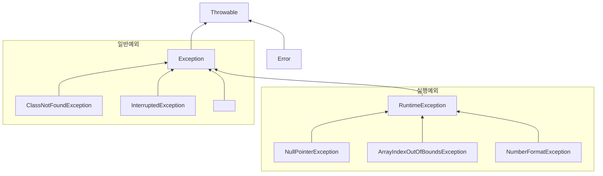
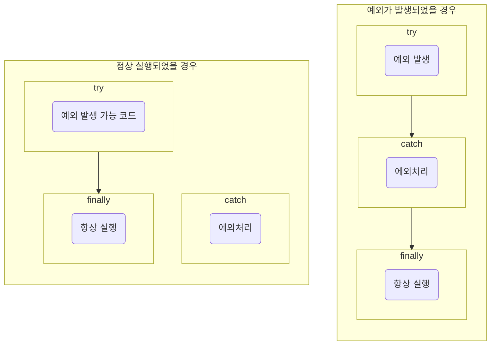
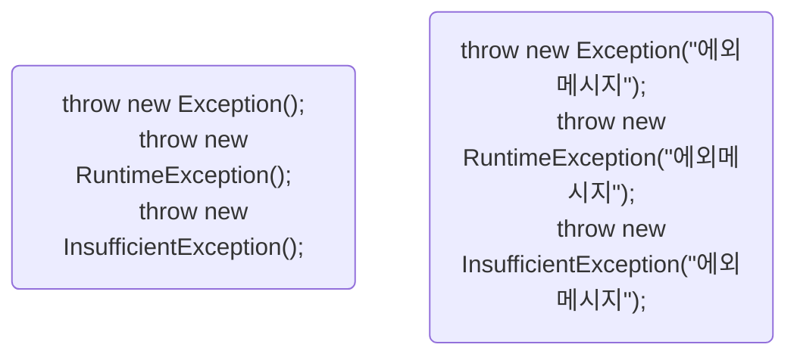

# Part 01 자바 언어 기초
## Chapter 11 예외 처리
### [11.1 예외와 예외 클래스](#-111-예외와-예외-클래스)
### [11.2 예외 처리 코드](#-112-예외-처리-코드)
### [11.3 예외 종류에 따른 처리](#-113-예외-종류에-따른-처리)
### [11.4 리소스 자동 닫기](#-114-리소스-자동-닫기)
### [11.5 예외 떠 넘기기](#-115-예외-떠-넘기기)
### [11.6 사용자 정의 예외](#-116-사용자-정의-예외)

## 🔖 11.1 예외와 예외 클래스
> 컴퓨터 하드웨어의 고장으로 인해 응용프로그램 실행 오류가 발생하는 것을 자바에서는 에러(Error)라고 함  
자바에서는 에러 이외에 예외(Exception)라고 부르는 오류가 있고 예외란 잘못된 사용 또는 코딩으로 인한 오류를 말함.  
예외가 발생하면 프로그램은 곧바로 종료된다는 점에서는 에러와 동일하지만, 예외 처리를 통해 계속 실행 상태를 유지할 수 있음.

- *일반 예외(Exception)*  
  컴파일러가 예외 처리 코드 여부를 검사하는 예외를 말함
- *실행 예외(Runtime Exception)*  
  컴파일러가 예외 처리 코드 여부를 검사하지 않는 예외를 말함  

자바는 예외가 발생하면 예외 클래스로부터 객체를 생성하고 이 객체는 예외 처리 시 사용되어짐.  
모든 에러와 예외 클래스는 Throwable 을 상속받아 만들어지고 추가적으로 예외 클래스는 java.lang.Exception 클래스를 상속 받음.



## 🔖 11.2 예외 처리 코드
> 예외가 발생했을때 프로그램의 갑작스러운 종료를 막고 정상 실행을 유지할 수 있도록 처리하는 코드를 예외 처리 코드라고 함.  
예외처리 코드는 `try-catch-finally` 블록으로 구성
* **`try-catch-finally` 블록은 생성자 내부와 메소드 내부에서 작성됨** 

- try 블록에서 작성한 코드가 예외 없이 정상 실행되면 catch 블록은 실행되지 않고 finally 블록이 실행
- try 블록에서 예외가 발생하면 catch 블록이 실행되고 연이어 finally 블록이 실행
- 예외 발생 여부와 상관없이 finally 블록은 항상 실행 (***finally 블록 생략가능***)

### p466. ExceptionHandlingExample1.java 예제
```java
package temp.src.ch11.sec02.exam01;

public class ExceptionHandlingExample1 {
    public static void printLength(String data) {
        int result = data.length();
        System.out.println("문자 수: " + result);
    }

    public static void main(String[] args) {
        System.out.println("[프로그램 시작]\n");
        printLength("ThisIsJava");
        printLength(null);
        System.out.println("[프로그램 종료]");
    }
}
```
```shell
#실행결과
[프로그램 시작]

문자 수: 10
Exception in thread "main" java.lang.NullPointerException: Cannot invoke "String.length()" because "data" is null
	at temp.src.ch11.sec02.exam01.ExceptionHandlingExample1.printLength(ExceptionHandlingExample1.java:5)
	at temp.src.ch11.sec02.exam01.ExceptionHandlingExample1.main(ExceptionHandlingExample1.java:12)
```
위 예제에서 예외 처리 코드를 추가하면 아래와 같다.
```java
package temp.src.ch11.sec02.exam01;

public class ExceptionHandlingExample2 {
    public static void printLength(String data) {
        try {
            int result = data.length();
            System.out.println("문자 수: " + result);
        } catch (NullPointerException e) {
            System.out.println(e.getMessage());
            //System.out.println(e.toString());
            //e.printStackTrace();
        } finally {
            System.out.println("[마무리 실행]\n");
        }
    }

    public static void main(String[] args) {
        System.out.println("[프로그램 시작]\n");
        printLength("ThisIsJava");
        printLength(null);
        System.out.println("[프로그램 종료]");
    }
}
```
```shell
#실행결과
[프로그램 시작]

문자 수: 10
[마무리 실행]

Cannot invoke "String.length()" because "data" is null
[마무리 실행]

[프로그램 종료]
```

```shell
#코드 - System.out.println(e.getMessage());
#출력결과
Cannot invoke "String.length()" because "data" is null


#코드 - System.out.println(e.toString());
#출력결과
java.lang.NullPointerException: Cannot invoke "String.length()" because "data" is null

#코드 - e.printStackTrace();
#출력결과 (프로그램 종료 후)
java.lang.NullPointerException: Cannot invoke "String.length()" because "data" is null
	at temp.src.ch11.sec02.exam01.ExceptionHandlingExample2.printLength(ExceptionHandlingExample2.java:6)
	at temp.src.ch11.sec02.exam01.ExceptionHandlingExample2.main(ExceptionHandlingExample2.java:20)
```


## 🔖 11.3 예외 종류에 따른 처리
try 블록에는 다양한 종류의 예외가 발생할 수 있는데 다중 catch 를 사용하면 발생하는 예외에 따라 예외 처리 코드를 다르게 작성할 수 있음  
```java
try {
    //ArrayIndexOutOfBoundsException 발생 -> goto catch1
    //NumberFormatException 발생 -> goto catch2 
} catch(ArrayIndexOutOfBoundsException e) {
    //catch1 예외처리
} catch(NumberFormatException e) {
    //catch2 예외처리
}
```
### p470. ExceptionHandlingExample.java
```java
package temp.src.ch11.sec03.exam01;

public class ExceptionHandlingExample {
    public static void main(String[] args) {
        String[] array = {"100", "1oo"};

        for(int i = 0 ; i <= array.length ; i++) {
            try {
                int value = Integer.parseInt(array[i]);
                System.out.println("array[" + i + "]: " + value);
            } catch (ArrayIndexOutOfBoundsException e) {
                System.out.println("배열 인덱스가 초과됨: " + e.getMessage());
            } catch (NumberFormatException e) {
                System.out.println("숫자로 변환할 수 없음: " + e.getMessage());
            }
        }

    }
}
```
```shell
#실행결과
array[0]: 100
숫자로 변환할 수 없음: For input string: "1oo"
배열 인덱스가 초과됨: Index 2 out of bounds for length 2
```
### 두개 이상의 예외를 상위 클래스 catch 블록을 나중에 작성해야 함.
- 예외가 발생하면 catch 블록은 위에서부터 차례대로 검사 대상이 되고 하위 예외도 상위 클래스 타입임으로 상위 클래스 catch 블록이 먼저 검사 대상이 되면 안된다.
```java
package temp.src.ch11.sec03.exam02;

public class ExceptionHandlingExample {
    public static void main(String[] args) {
        String[] array = {"100", "1oo"};

        for(int i = 0 ; i <= array.length ; i++) {
            try {
                int value = Integer.parseInt(array[i]);
                System.out.println("array[" + i + "]: " + value);
            } catch (ArrayIndexOutOfBoundsException e) {
                System.out.println("배열 인덱스가 초과됨: " + e.getMessage());
            } catch (Exception e) {
                System.out.println("실행에 문제가 있습니다.");
            }
        }
    }
}
```
```shell
#실행결과
array[0]: 100
실행에 문제가 있습니다.
배열 인덱스가 초과됨: Index 2 out of bounds for length 2
```
### 두 개 이상의 예외를 하나의 catch 블록으로 동일하게 예외처리하려면 기호 |로 연결하면 됨 
```java
package temp.src.ch11.sec03.exam03;

public class ExceptionHandlingExample {
    public static void main(String[] args) {
        String[] array = {"100", "1oo", null, "200"};

        for(int i = 0 ; i <= array.length ; i++) {
            try {
                int value = Integer.parseInt(array[i]);
                System.out.println("array[" + i + "]: " + value);
            } catch (ArrayIndexOutOfBoundsException e) {
                System.out.println("배열 인덱스가 초과됨: " + e.getMessage());
            } catch (NullPointerException | NumberFormatException e) {
                System.out.println("데이터에 문제가 있음: " + e.getMessage());
            }
        }
    }
}
```
```shell
#실행결과
array[0]: 100
데이터에 문제가 있음: For input string: "1oo"
데이터에 문제가 있음: Cannot parse null string
array[3]: 200
배열 인덱스가 초과됨: Index 4 out of bounds for length 4
```


## 🔖 11.4 리소스 자동 닫기
리소스(resource)란 데이터를 제공하는 객체를 말함. 리소스는 사용하기 위해 열어야 하며, 사용이 끝난 다음에는 닫아야 한다.  
예를 들어 파일 내용을 읽기 위해서는 파일을 열어야 하며 다 읽고 난 후에은 파일을 닫아야 다른 프로그램에서 사용할 수 있음
```java
FileInputStream fis = null;
try {
    fis = new FileInputStream("file.txt");  //파일 열기
} catch(IOException e) {
    ...
} finally {
    fis.close();                            //파일 닫기
}
```
### try-with-resources 블록을 사용하면 예외 발생과 상관없이 리소스를 자동으로 닫아줌
```java
try(FileInputStream fis = new FileInputStream("file.txt")) {
    ...
} catch(IOException e) {
    ...
}
```
* try-with-resources 블록을 사용하기 위한 조건
* 리소스는 java.lang.AutoCloseable 인터페이스를 구현해서 AutoCloseable 인터페이스의 close() 메소드를 재정의해야 함  
에를 들어 FileInput Stream 는 다음과 같이 AutoCloseable 인터페이스를 구현하고 있음.
```java
public class FileInputStream implements AutoCloseable {
    ...
    @Override
    public void close() throws Exception { ... }
}
```
### Java 8 이전 버전은 try 괄호 안에서 리소스 변수를 반드시 선언해야 했지만, Java 9 이후부터는 외부 리소스 변수를 사용할 수 있음
```java
FileInputStream fis1 = new FileInputStream("file1.txt");
FileInputStream fis2 = new FileInputStream("file2.txt");
try(fis1; fis2) {
    ...
} catch(IOException e) {
    ...
}
```
### p475. TryWithResourceExample.java 예재
```java
package temp.src.ch11.sec04;

public class MyResource implements AutoCloseable {
    private String name;

    public MyResource(String name) {
        this.name = name;
        System.out.println("[MyResource(" + name + ") 열기]");
    }

    public String read1() {
        System.out.println("[MyResource(" + name + ") 읽기]");
        return "100";
    }

    public String read2() {
        System.out.println("[MyResource(" + name + ") 읽기]");
        return "abc";
    }

    @Override
    public void close() throws Exception {
        System.out.println("[MyResource(" + name + ") 닫기]");
    }
}
```
```java
package temp.src.ch11.sec04;

public class TryWithResourceExample {
    public static void main(String[] args) {
        try (MyResource res = new MyResource("A")) {
            String data = res.read1();
            int value = Integer.parseInt(data);
        } catch (Exception e) {
            System.out.println("예외 처리: " + e.getMessage());
        }

        System.out.println();

        try (MyResource res = new MyResource("A")) {
            String data = res.read2();
            //NumberFormatException 발생
            int value = Integer.parseInt(data);
        } catch (Exception e) {
            System.out.println("예외 처리: " + e.getMessage());
        }

        System.out.println();

        MyResource res1 = new MyResource("A");
        MyResource res2 = new MyResource("B");
        try (res1; res2) {
            String data1 = res1.read1();
            String data2 = res2.read1();
        } catch (Exception e) {
            System.out.println("예외 처리: " + e.getMessage());
        }
    }
}
```
```shell
#실행결과
[MyResource(A) 열기]
[MyResource(A) 읽기]
[MyResource(A) 닫기]

[MyResource(A) 열기]
[MyResource(A) 읽기]
[MyResource(A) 닫기]
예외 처리: For input string: "abc"

[MyResource(A) 열기]
[MyResource(B) 열기]
[MyResource(A) 읽기]
[MyResource(B) 읽기]
[MyResource(B) 닫기]
[MyResource(A) 닫기]
```


## 🔖 11.5 예외 떠 넘기기
메소드 내부에서 예외가 발생할 때 try-catch 블록으로 예외를 처리하는 것이 기본이지만, 메소드를 호출한 곳에서 예외를 떠넘길 수도 있음.  
- ***throws*** 키워드를 사용하고 메소드 선언부 끝에 작성해야함.
- 떠넘길 예외 클래스를 쉼표로 구분해서 나열해주면 됨.
```java
리턴타입 메소드명(매개변수, ...) throws 에외클래스1, 예외클래스2, ... {
}
```
### p478. ThrowsExample.java 예재
```java
package temp.src.ch11.sec05;

public class ThrowsExample {
    public static void main(String[] args) {
        try {
            findClass();
        } catch (ClassNotFoundException e) {
            System.out.println("예외 처리: " + e.toString());
        }
    }

    public static void findClass() throws ClassNotFoundException {
        Class.forName("java.lang.String2");
    }
}
```
```shell
#실행결과
예외 처리: java.lang.ClassNotFoundException: java.lang.String2
```
나열해야 할 예외 클래스가 많을 경우 throws Exception 또는 throws Throwalbe 만으로 모든 예외를 간단히 떠넘길 수 있다.
```java
리턴타입 메소드명(매개변수, ...) throws Exception {
}
```
main() 메소드에서도 throws 키워드를 사용해서 예외를 떠넘길 수 있으나 결곽 JVM이 최종적으로 예외처리를 하게 됨 (콘솔에 에러출력)
```java
public static void main(String[] args) throws Exception {
    ...
}
```
```java
package temp.src.ch11.sec05;

public class ThrowsExample2 {
    public static void main(String[] args) throws Exception {
        findClass();
    }

    public static void findClass() throws ClassNotFoundException {
        Class.forName("java.lang.String2");
    }
}
```
```shell
#실행결과
Exception in thread "main" java.lang.ClassNotFoundException: java.lang.String2
	at java.base/jdk.internal.loader.BuiltinClassLoader.loadClass(BuiltinClassLoader.java:641)
	at java.base/jdk.internal.loader.ClassLoaders$AppClassLoader.loadClass(ClassLoaders.java:188)
	at java.base/java.lang.ClassLoader.loadClass(ClassLoader.java:525)
	at java.base/java.lang.Class.forName0(Native Method)
	at java.base/java.lang.Class.forName(Class.java:375)
	at temp.src.ch11.sec05.ThrowsExample2.findClass(ThrowsExample2.java:9)
	at temp.src.ch11.sec05.ThrowsExample2.main(ThrowsExample2.java:5)
```


## 🔖 11.6 사용자 정의 예외
은행의 뱅킹 프로그램에서 잔고보다 더 많은 출금 요청이 들어온 경우에는 `잔고 부족 예외` 를 발생시킬 필요가 있으나 표준 라이브러리에는 존재하지 않기 때문에 직접 예외 클래스를 정의해서 사용해야 함
### 사용자 정의 예외
사용자 정의 예외는 컴파일러가 체크하는 일반 예외로 선언할 수 도 있고, 컴파일러가 체크하지 않는 실행 예외로 선언할 수도 있음.  
- 일반 예외는 Exception 의 자식 클래스로 선언
- 실행예외는 RuntimeException 의 자식 클래스로 선언
```java
public class XXXException extends [ Exception | RuntimeException ] {

    public XXXException() {                     // 기본생성자
    }

    public XXXException(String message) {       // 예외 메시지를 입력받는 생성자
        super(message);
    }

}
```
### p480. InsufficientException.java 잔고 부족 예외 사용자 정의 예외 클래스 선언 예재
```java
package temp.src.ch11.sec06;

public class InsufficientException extends Exception {
    public InsufficientException() {
    }

    public InsufficientException(String message) {
        super(message);
    }
}
```
### 예외 발생 시키기
자바에서 제공하는 표준 예외뿐만 아니라 사용자 정의 예외를 직접 코드에서 발생시키려면 throw 키워드와 함께 예외 객체를 제공하면 됨  
예외의 원인에 해당하는 메시지를 제공하고 싶다면 생성자 매개값으로 전달

### p481. AccountExample.java 예재
```java
package temp.src.ch11.sec06;

public class Account {
    private long balance;

    public Account() { }

    public long getBalance() {
        return balance;
    }

    public void deposit(int money) {
        balance += money;
    }

    public void withdraw(int money) throws InsufficientException {
        if(balance < money) {
            throw new InsufficientException("잔고 부족: " + (money-balance) + " 모자람");
        }
        balance -= money;
    }
}
```
```java
package temp.src.ch11.sec06;

public class AccountExample {
    public static void main(String[] args) {
        Account account = new Account();

        //예금하기
        account.deposit(10000);
        System.out.println("예금액: " + account.getBalance());

        //출금하기
        try {
            int amount = 30000;
            System.out.println("출금액: " + amount);
            account.withdraw(amount);
            System.out.println("잔액: " + account.getBalance());
        } catch (InsufficientException e) {
            String message = e.getMessage();
            System.out.println(message);
        }
    }
}
```
```shell
#출력결과
예금액: 10000
출금액: 30000
잔고 부족: 20000 모자람
```