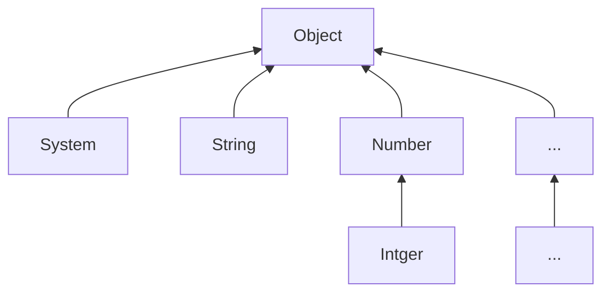
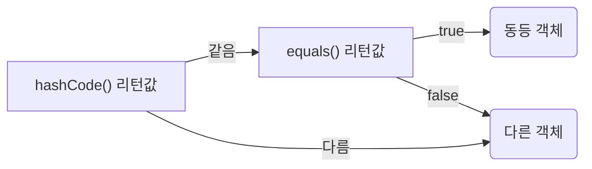
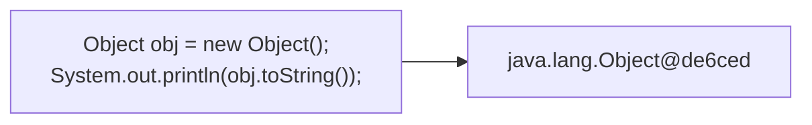

# Part 03 라이브러리 활용
## Chapter 12 java.base 모듈
### [12.1 API 도큐먼트](#-121-api-도큐먼트)
### [12.2 java.base 모듈](#-122-javabase-모듈)
### [12.3 Object 클래스](#-123-Object-클래스)
### [12.4 System 클래스](#-124-System-클래스)
### [12.5 문자열 클래스](#-125-문자열-클래스)
### [12.6 포장 클래스](#-126-포장-클래스)
### [12.7 수학 클래스](#-127-수학-클래스)
### [12.8 날짜와 시간 클래스](#-128-날짜와-시간-클래스)
### [12.9 형식 클래스](#-129-형식-클래스)
### [12.10 정규 표현식 클래스](#-1210-정규-표현식-클래스)
### [12.11 리플렉션](#-1211-리플렉션)
### [12.12 어노테이션](#-1212-어노테이션)

## 🔖 12.1 API 도큐먼트
자바 표준 모듈에서 제공하는 라이브러리는 방대하기 때문에 쉽게 찾아서 사용할 수 있도록 도와주는 API 도큐먼트가 있음.  
라이브러리가 클래스와 인터페이스의 집합이라면, API 도큐먼트는 이를 사용하기 위한 방법을 기술한 것
> https://docs.oracle.com/en/java/javase/index.html  

```text
String 도큐먼트를 찾는 3가지 방법

방법1 : 웹사이트 메뉴 이용
  1. [All Modules] 탭에서 java.base 모듈을 클릭한다.
  2. java.base 의 Packages 목록에서 java.lang 패키지를 클릭한다.
  3. java.lang 의 [All Classes and Interfaces] 탭에서 String 클래스를 클릭한다.
  
방법2 : 웹사이트 검색 이용
  1. 오른쪽 상단의 Search 검색란에 'String' 을 입력한다.
  2. 드롭다운 목록에서 java.lang.String 항목을 선택한다.
  
방법3 : IDE 이용
  1. 자바 코드에서 String 클래스를 마우스로 선택한 다음 cmd + Click
  2. cmd + shift + o 를 누르고 'String.java' 검색 (Project 내 일 경우 단축기 한번 더 누르면 토글)
```

### 클래스 선언부 보기
API 도큐먼트에서 String 클래스가 어떻게 정의되었는지 보려면 1 선언부를 보면 된다. 여기서는 클래스가 final 인지 추상(abstract) 인지를 알 수 있고, 부모 클래스와 구현 인터페이스를 볼 수 있다. 전체 상속 관계를 보려면 상속 계층도를 보면 된다.

### 구성 멤버 보기
String 이 가지고 있는 멤버를 보려면 상단 메뉴의 SUMMARY를 활용 (SUMMARY는 선언된 멤버별로 이동하는 링크를 제공)  
링크가 있으면 공개된 (public, protected) 멤버가 있다는 뜻이고, 링크가 없으면 공개된 멤버가 없다는 뜻
- NESTED: 중첩 클래스/중첩 인터페이스 목록으로 이동하는 링크
- FIELD: 필드 목록으로 이동하는 링크
- CONSTR: 생성자 목록으로 이동하는 링크
- METHOD: 메소드 목록으로 이동하는 링크

### 필드 보기
SUMMARY에서 FIELD 링크를 클릭하면 필드 목록으로 이동
Modifier and Type 에서는 Static 여부와 필드 타입을 알 수 있고, Field와 Description은 필드명과 그에 대한 간단한 설명  
**관례적으로 필드 이름이 모두 대문자이면 public static final 로 선언된 상수필드**

### 생성자 보기
SUMMARY에서 CONSTR 링크를 클릭하면 생성자 목록으로 이동  
Constructor에서는 생성자의 매개변수 타입을 알 수 있고 Description은 이에 대한 간단한 설명  
String 클래스는 매개변수 타입과 개수를 달리한 10개가 넘는 생성자들이 오버로딩되어 있음

### 메소드 보기
SUMMARY에서 METHOD 링크를 클릭하면 메소드 목록으로 이동
- All Methods: 모든 메소드 목록을 보여줌
- Static Methods: 정적 메소드 목록을 보여줌
- Instance Methods: 인스턴스 메소드 목록을 보여줌
- Concrete Methods: 완전한 실행부를 갖춘 메소드 목록을 보여줌
- Deprecated Methods: 향후 제거될 메소드 목록을 보여줌

Modifier and Type 에서는 static 여부와 리턴 타입이 무엇인지 알 수 있음  

## 🔖 12.2 java.base 모듈
java.base는 모든 모듈이 의존하는 기본 모듈로, 모듈 중 유일하게 requires하지 않아도 사용할 수 있음  
이 모듈에 포함되어 있는 패키지는 대부분 자바 프로그램에서 많이 사용하는 것

### java.base 모듈에 포함된 주요 패키지와 용도
| 패키지       | 용도                                      |
|-----------|-----------------------------------------|
| java.lang | 자바 언어의 기본 클래스를 제공                       |
| java.util | 자료 구조와 관련된 컬렉션 클랙스를 제공                  |
| java.text | 날짜 및 숫자를 원하는 형태의 문자열로 만들어 주는 포맷 클래스를 제공 |
| java.time | 날짜 및 시간을 조작하거나 연산하는 클래스를 제공             |
| java.io   | 입출력 스트림 클래스를 제공                         |
| java.net  | 네트워크 통신과 관련된 클래스를 제공                    |
| java.nio  | 데이터 저장을 위한 Buffer 및 새로운 입출력 클래스 제공      |
java.lang은 자바 언어의 기본적인 클래스를 담고 있는 패키지로, 이 패키지에 있는 클래스와 인터페이스는 import 없이 사용할 수 있음.

### java.lang 패키지에 포함된 주요 클래스와 용도
<table>
    <thead>
        <tr>
            <th colspan="2">클래스</th>
            <th>용도</th>
        </tr>
    </thead>
    <tbody>
        <tr>
            <td colspan="2">Object</td>
            <td>- 자바 클래스의 최상위 클래스로 사용</td>
        </tr>
        <tr>
            <td colspan="2">System</td>
            <td>- 키보드로부터 데이터를 입력받을 때 사용<br/>- 모니터(콘솔)로 출력하기 위해 사용<br/>- 프로세스를 종료시킬 때 사용<br/>- 진행시간을 읽을 때 사용<br/>- 시스템 속성(프로퍼티)을 읽을 때 사용</td>
        </tr>
        <tr>
            <td rowspan="3">문자열<br>관련</td>
            <td>String</td>
            <td>- 문자열을 저장하고 조작할 때 사용</td>
        </tr>
        <tr>
            <td>StringBuilder</td>
            <td>- 효율적인 문자열 조작 기능이 필요할 때 사용</td>
        </tr>
        <tr>
            <td>java.util.StringTokenizer</td>
            <td>- 구분자로 연결된 문자열을 분리할 때 사용</td>
        </tr>
        <tr>
            <td>포장<br>관련</td>
            <td>Byte, Short, Charactor<br>Integer, Float, Double<br>Boolean</td>
            <td>- 기본 타입의 값을 포장할 때 사용<br>- 문자열을 기본 타입으로 변환할 때 사용</td>
        </tr>
        <tr>
            <td colspan="2">Math</td>
            <td>- 수학 계산이 필요할 때 사용</td>
        </tr>
        <tr>
            <td colspan="2">Class</td>
            <td>- 클래스의 메타 정보(이름, 구성 멤버) 등을 조사할 때 사용</td>
        </tr>
    </tbody>
</table>

## 🔖 12.3 Object 클래스
>클래스를 선언할 때 extends 키워드로 다른 클래스를 상속하지 않으면 한시적으로 java.lang.Object 클래스를 상속하게 된다. 따라서 자바의 모든 클래스는 Object의 자식이거나 자손 클래스임

그렇기 때문에 Object 가 가진 메소드는 모든 객체에서 사용할 수 있음.

### Object 의 주요 메소드
| 메소드                        | 용도                  |
|----------------------------|---------------------|
| boolean equals(Object obj) | 객체의 번지를 비교하고 결과를 리턴 |
| int hashCode()             | 객체의 해시코드를 리턴        |
| String toString()          | 객체 문자 정보를 리턴        |

### 객체 동등 비교
Object의 equals() 메소드는 객체의 번지를 비교하고 boolean 값을 리턴
```java
public boolean equals(Object obj)
```
equals() 메소드의 매개변수 타입이 Object 이므로 자동 타입 변환에 의해 모든 객체가 매개값으로 대입될 수 있음.  
equals() 메소드는 비교 연산자인 == 과 동일한 결과를 리턴, 두 객체가 동일한 객체라면 true를 리턴하고, 그렇지 않으면 false를 리턴함
```java
Object obj1 = new Object();
Object obj2 = obj1;
boolean result = obj1.equals(obj2); // true
boolean result = (obj1 == obj2);    // true
```
### p498. EqualsExample.java 예재
```java
package temp.src.ch12.sec03;

public class Member {
    public String id;

    public Member(String id) {
        this.id = id;
    }

    @Override
    public boolean equals(Object obj) {
        if(obj instanceof Member target) {
            if(id.equals(target.id)) {
                return true;
            }
        }
        return false;
    }
}
```
```java
package temp.src.ch12.sec03;

public class EqualsExample {
    public static void main(String[] args) {
        Member obj1 = new Member("blue");
        Member obj2 = new Member("blue");
        Member obj3 = new Member("red");

        if(obj1.equals(obj2)) {
            System.out.println("obj1과 obj2는 동등합니다.");
        } else {
            System.out.println("obj1과 obj2는 동등하지 않습니다.");
        }

        if(obj1.equals(obj3)) {
            System.out.println("obj1과 obj3는 동등합니다.");
        } else {
            System.out.println("obj1과 obj3는 동등하지 않습니다.");
        }
    }
}
```
```shell
#실행결과
obj1과 obj2는 동등합니다.
obj1과 obj3는 동등하지 않습니다.
```

### 객체 해시코드
객체 해시코드란 객체를 식별하는 정수를 말함  
Object 의 hashCode() 메소드는 객체의 메모리 번지를 이용해서 해시코드를 생성하기 때문에 객체마다 다른 정수값을 리턴  
hashCode() 메소드의 용도는 equals() 메소드와 비슷한데, 두 객체가 동등한지를 비교할 때 주로 사용
```java
public int hashCode()
```
equals() 메소드와 마찬가지로 hashCode() 메소드 역시 객체의 데이터를 기준으로 재정의해서 새로운 정수값을 리턴하도록 하는 것이 일반적. 객체가 다르다 할지라도 내부 데이터가 동일하다면 같은 정수값을 리턴하기 위함.  
자바는 두 객체가 동등함을 비교할 때 hashCode()와 equals() 메소드를 같이 사용하는 경우가 많음. 우선 hashCode() 가 리턴하는 정수값이 같은지를 확인하고, 그 다음 equals() 메소드가 true를 리턴하는지를 확인해서 동등 객체임을 판단함.

### p500. HashCodeExample.java 예재
```java
package temp.src.ch12.sec03.exam02;

public class Student {
    private int no;
    private String name;

    public Student(int no, String name) {
        this.no = no;
        this.name = name;
    }

    public int getNo() { return no; }
    public String getName() { return name; }

    @Override
    public int hashCode() {
        int hashCode = no + name.hashCode();
        return hashCode;
    }

    @Override
    public boolean equals(Object obj) {
        if(obj instanceof Student target) {
            if(no == target.getNo() && name == target.getName()) {
                return true;
            }
        }
        return false;
    }
}
```
```java
package temp.src.ch12.sec03.exam02;

public class HashCodeExample {
    public static void main(String[] args) {
        Student s1 = new Student(1, "홍길동");
        Student s2 = new Student(1, "홍길동");

        if(s1.hashCode() == s2.hashCode()) {
            if(s1.equals(s2)) {
                System.out.println("동등 객체입니다.");
            } else {
                System.out.println("데이터가 다르므로 동등 객체가 아닙니다.");
            }
        } else {
            System.out.println("해시코드가 다르므로 동등 객체가 아닙니다.");
        }
    }
}
```
```shell
#실행결과
동등 객체입니다.
```

### p502. Student 객체를 HashSet에 저장하고 저장된 개수를 확인해보기
```java
package temp.src.ch12.sec03.exam02;

import java.util.HashSet;

public class HashSetExample {
    public static void main(String[] args) {
        HashSet hashSet = new HashSet();

        Student s1 = new Student(1, "홍길동");
        hashSet.add(s1);
        System.out.println("저장된 객체 수: " + hashSet.size());

        Student s2 = new Student(1, "홍길동");
        hashSet.add(s2);
        System.out.println("저장된 객체 수: " + hashSet.size());

        Student s3 = new Student(2, "홍길동");
        hashSet.add(s3);
        System.out.println("저장된 객체 수: " + hashSet.size());
    }
}
```
```shell
#실행결과
저장된 객체 수: 1
저장된 객체 수: 1
저장된 객체 수: 2
```

### 객체 문자 정보
Object 의 toString() 메소드는 객체의 문자 정보(객체를 문자열로 표현한 값)를 리턴함.  
기본적으로 Object의 toString() 메소드는 '클래스명@16진수해시코드'로 구성된 문자열을 리턴.

#### p504. ToStringExample.java 예재
```java
package temp.src.ch12.sec03.exam03;

public class ToStringExample {
    public static void main(String[] args) {
        SmartPhone myPhone = new SmartPhone("삼성전자", "안드로이드");

        String strObj = myPhone.toString();
        System.out.println(strObj);

        System.out.println(myPhone);
    }
}
```
```shell
#실행결과
삼성전자 안드로이드
삼성전자 안드로이드
```
> **System.out.println() 메소드는 매개값이 기본 타입(byte, short, int, long, float, double, boolean)이거나 문자열일 경우 해당 값을 그대로 출력**  
> **만약 매개값이 객체가 되면 객체의 toString() 메소드를 호출해서 리턴값을 출력**

### 레코드 선언
데이터 전달을 위한 DTO<sup>Data Transfer Object</sup>를 작성할 때 반복적으로 사용되는 코드를 줄이기 위해 Java 14부터 레코드<sup>recode</sup>가 도입됨.

```java
public class Person {
    private final String name;
    private final int age;

    public Person(String name, int age) {
        this.name = name;
        this.age = age;
    }

    public String name() { return name; }
    public String age() { return age; }
    
    @Override
    public int hashCode() { ... }
    
    @Override
    public boolean equals(Object obj) { ... }
    
    @Override
    public String toString() { ... }
}
```
Person의 데이터(필드)는 읽기만 가능하도록 필드를 private final로 선언하였으며, 필드 이름과 동일한 Getter 메소드(name(), age())를 가지고 있음. 그리고 동등 비교를 위해 hashCode(), equals() 메소드를 재정의하고 있고, 의미 있는 문자열 출력을 위해 toString() 메소드를 재정의하고 있음.  

*위와 동일한 코드를 생성하는 레코드 선언*  
*(class 대신 recode를 사용하고 이름 뒤에 괄호를 작성해서 저장할 데이터의 종류를 변수로 선언)*
```java
public record Person(String name, int age) {
}
```

### 롬복 사용하기
롬복<sup>rombok</sup>은 JDK에 포함된 표준 라이브러리는 아니지만 개발자들이 즐겨 쓰는 자동 코드 생성 라이브러리  
롬복은 레코드와 마찬가지로 DTO 클래스를 작성할 때 Getter, Setter, hashCode(), equals(), toString() 메소드를 자동 생성하기 때문에 작성할 코드의 양을 줄여줌  
레코드와의 차이점은 final이 아니며, 값을 읽는 Getter는 getXxx(또는 isXxx)로, 값을 변경하는 Setter는 setXxx로 생성된다는 것임.  
### p509. Member.java 예재
```java
package temp.src.ch12.sec03.exam05;

import lombok.Data;

@Data
public class Member {
    private String id;
    private String name;
    private int age;
}
```
> exam05 (package)
>> Member.java (file)
>>> Member (class)
>>>> age  
>>>> id   
>>>> name     
>>>> Member()   
>>>> canEqual(Object): boolean    
>>>> equal(Object): boolean    
>>>> getAge(): int  
>>>> getId(): String  
>>>> getName(): String  
>>>> hashCode(): int  
>>>> setAge(int): void  
>>>> setId(String): void  
>>>> setName(String): void  
>>>> toString(): String

@Data 외에도 다음과 같은 어노테이션을 사용할 수 있음.

| 어노테이션                    | 설명                                                                          |
|--------------------------|-----------------------------------------------------------------------------|
| @NoArgsConstructor       | 기본(매개변수가 없는) 생성자 포함                                                         |
| @AllArgsConstructor      | 모든 필드를 초기화시키는 생성자 포함                                                        |
| @RequiredArgsConstructor | 기본적으로 매개변수가 없는 생성자 포함. 만약 final 또는 @NonNull이 붙은 필드가 있다면 이 필드만 초기화시키는 생성자 포함 |
| @Getter                  | Getter 메소드 포함                                                               |
| @Setter                  | Setter 메소드 포함                                                               |
| @EqualsAndHashCode       | equals()와 hashCode() 메소드 포함                                                 |
| @ToString                | toString() 메소드 포함                                                           |  

### p510. 매개변수가 없는 기본 생성자뿐만 아니라 모든 필드를 초기화하는 생성자까지 포함하는 예재
```java
package temp.src.ch12.sec03.exam05;

import lombok.AllArgsConstructor;
import lombok.Data;
import lombok.NoArgsConstructor;

@Data
@NoArgsConstructor
@AllArgsConstructor
public class Member {
    private String id;
    private String name;
    private int age;
}
```
> Member.java
>> Member
>>> ..    
>>> **member()**  
>>> **member(String, String, int)**  

@Data 에 포함되어 있는 @RequiredArgsConstructor는 기본적으로 매개변수가 없는 생성자를 포함시키지만 final 또는 @NonNull 이 붙은 필드가 있다면 이 필드만 초기화시키는 생성자를 포함시킴
```java
package temp.src.ch12.sec03.exam05;

import lombok.Data;
import lombok.NonNull;

@Data
public class Member {
    private final String id;
    @NonNull private String name;
    private int age;
}
```
* *final과 @NonNull의 차이점은 초기화된 final 필드는 변경할 수 없지만(Setter 만들어지지 않음), @NonNull은 null이 아닌 다른 값으로 Setter를 통해 변경할 수 있음*
> Member.java
>> Member
>>> ..      
>>> **member(String, @NonNull String)**  


## 🔖 12.4 System 클래스
자바 프로그램은 운영체재상에서 바로 실행되는 것이 아니라 자바 가상 머신(JVM) 위에서 실행되고 따라서 운영체재의 모든 기능을 자바 코드로 직접 접근하긴 어렵지만 java.lang 패키지에 속하는 System 클래스를 이용하면 운영체제의 일부 기능을 이용 가능  
System 클래스의 정적<sup>static</sup> 필드와 메소드를 이용하면 프로그램 종료, 키보드 입력, 콘솔 출력, 현재시간 읽기, 시스템 프로퍼티 읽기 등이 가능

### 콘솔 출력
out 과 비슷하지만 err는 콘솔 종류에 따라 에러 내용이 빨간색으로 출력
```java
System.err.println("에러 내용");
```
```shell
#실행결과
[에러 내용]
```

### 키보드 입력
자바는 키보드로부터 입력된 키를 읽기 위해 System 클래스에서 in 필드를 제공  
```java
int keyCode = System.in.read();
```
### p514. InExample.java 예재
```java
package temp.src.ch12.sec04;

public class InExample {
    public static void main(String[] args) throws Exception {
        int speed = 0;
        int keyCode = 0;

        while(true) {
            //Enter 키를 읽지 않았을 경우에만 실행
            if (keyCode != 13 && keyCode != 10) {
                if (keyCode == 49) {        //숫자 1 키를 읽었을 경우
                    speed++;
                } else if (keyCode == 50) { //숫자 2 키를 읽었을 경우
                    speed--;
                } else if (keyCode == 51) { //숫자 3 키를 읽었을 경우
                    break;
                }
                System.out.println("------------------------");
                System.out.println("1. 증속 | 2. 감속 | 3. 중지");
                System.out.println("------------------------");
                System.out.println("현재 속도=" + speed);
                System.out.print("선택: ");
            }

            //키를 하나씩 읽음
            keyCode = System.in.read();
        }

        System.out.println("프로그램 종료");
    }
}
```
```shell
#실행결과
------------------------
1. 증속 | 2. 감속 | 3. 중지
------------------------
현재 속도=0
선택: 1
------------------------
1. 증속 | 2. 감속 | 3. 중지
------------------------
현재 속도=1
선택: 2
------------------------
1. 증속 | 2. 감속 | 3. 중지
------------------------
현재 속도=0
선택: 3
프로그램 종료
```

### 프로세스 종료
운영체제는 실행 중인 프로그램을 프로세스<sup>process</sup>로 관리함.  
자바 프로그램을 시작하면 JVM 프로세스가 생성되고 이 프로세스가 main() 메소드를 호출함.  
프로세스를 강제 종료하고 싶다면 System.exit() 메소드를 사용.
```java
System.exit(int status)
```
*정상종료 0, 비정상 종료 1 또는 -1로 주는 것이 관례*
> 종료 상태값은 System에 설정되는 SecurityManager에서 활용되는데, 종료 상태값에 따라 특정 행위를 할 수 있도록 코딩할 수 있으나 java 17에서 SecurityManager가 Deprecated 됨

### 진행 시간 읽기
System 클래스의 currentTimeMillis() 메소드와 nanoTime() 메소드는 1970년 1월 1일 0시부터 시작해서 현재까지 진행된 시간을 리턴  

| 메소드                      | 용도                               |
|--------------------------|----------------------------------|
| long currentTimeMillis() | 1/1000초 단위로 진행된 시간을 리턴           |
| long nanoTime()          | 1/10<sup>9</sup>초 단위로 진행된 시간을 리턴 |
- 위 두 메소드는 프로그램 처리 시간을 측정하는 데 주로 사용
- 프로그램 처리를 시작할 때 한번 끝날 때 한 번 읽어서 그 차이를 구하면 프로그램 처리 시간 산출 가능  

#### p517. MeasureRunTimeExample.java 예재
```java
package temp.src.ch12.sec04;

public class MeasureRunTimeExample {
    public static void main(String[] args) {
        long time1 = System.nanoTime();
        int sum = 0;
        for(int i=1; i<= 1000000; i++) {
            sum += i;
        }
        long time2 = System.nanoTime();

        System.out.println("1-1000000까지의 합: " + sum);
        System.out.println("계산에 " + (time2 - time1) + " 나노초가 소요되었습니다.");
    }
}
```
```shell
#실행결과
1-1000000까지의 합: 1784293664
계산에 1778250 나노초가 소요되었습니다.
```

### 시스템 프로퍼티 읽기
시스템 프로퍼티<sup>System Property</sup>란 자바 프로그램이 시작될 때 자동 설정되는 시스템의 속성을 말함  
예를 들어 운영체제 종류 및 사용자 정보, 자바 버전 등의 기본 사양 정보가 해당

| 속성 이름(key)                 | 설명            | 값(value)                |
|----------------------------|---------------|-------------------------|
| java.specification.version | 자바 스펙 버전      | 17                      |
| java.home                  | JDK 디렉토리 경로   | /usr/bin/jdk-17.0.3     |
| os.name                    | 운영체재          | Mac OS X                |
| user.name                  | 사용자 이름        | xxx                     |
| user.home                  | 사용자 홈 디렉토리 경로 | /Users/xxx              |
| user.dir                   | 현재 디렉토리 경로    | /Users/xxx/this-is-java |

#### p518. GetPropertyExample.java 예재
```java
package temp.src.ch12.sec04;

import java.util.Properties;
import java.util.Set;
public class GetPropertyExample {
    public static void main(String[] args) {
        String osName = System.getProperty("os.name");
        String userName = System.getProperty("user.name");
        String userHome = System.getProperty("user.home");
        System.out.println(osName);
        System.out.println(userName);
        System.out.println(userHome);

        System.out.println("-----------------------------");
        System.out.println(" key: value");
        System.out.println("-----------------------------");
        Properties props = System.getProperties();
        Set keys = props.keySet();
        for(Object objKey : keys) {
            String key = (String) objKey;
            String value = System.getProperty(key);
            System.out.printf("%-40s: %s\n", key, value);
        }
    }
}
```
```shell
#실행결과
Mac OS X
xxx
/Users/xxx
-----------------------------
 key: value
-----------------------------
java.specification.version              : 17
sun.jnu.encoding                        : UTF-8
java.class.path                         : /Users/xxx/dev/study/this-is-java/out/production/this-is-java:/Users/xxx/.m2/repository/org/projectlombok/lombok/1.18.26/lombok-1.18.26.jar
...
```


## 🔖 12.5 문자열 클래스
| 클래스             | 설명                     |
|-----------------|------------------------|
| String          | 문자열을 저장하고 조작할때 사용      |
| StringBuilder   | 효율적인 문자열 조작 기능이 필요할때 사용 |
| StringTokenizer | 구분자로 연결된 문자열을 분리할 때 사용 |

### String 클래스
String 클래스는 문자열을 저장하고 조작할 때 사용.  
문자열 리터럴은 자동으로 String 객체로 생성되지만, String 클래스의 다양한 생성자를 이용해서 직접 객체 생성도 가능  
```java
//기본 문자셋으로 byte 배열을 디코딩해서 String 객체로 생성
String str = new String(byte[] bytes);
```
```java
//특정 문자셋으로 byte 배열을 디코딩해서 String 객체로 생성
String str = new String(byte[] bytes, String charsetName);
```
*한글 1자를 UTF-8로 인코딩하면 3바이트가 되고, EUC-KR로 인코딩하면 2바이트가 됨. 따라서 인코딩할 때 사용한 문자셋으로 디코딩을 해야만 한글이 올바르게 복원*

### StringBuilder 클래스
String은 내부 문자열을 수정할 수 없음.
```java
String data = "ABC";
//내부 문자열을 변경하는 것처럼 보이지만 사실 'ABCDEF'라는 새로운 String 객체를 생성
data += "DEF";
```
| 리턴 타입         | 메소드(매개변수)                 | 설명             |
|---------------|---------------------------|----------------|
| StringBuilder | append(기본값 \| 문자열)        | 문자열을 끝에 추가     |
| StringBuilder | insert(위치, 기본값 \| 문자열)    | 문자열을 지정 위치에 추가 |
| StringBuilder | delete(시작 위치, 끝 위치)       | 문자열 일부를 삭제     |
| StringBuilder | replace(시작 위치, 끝 위치, 문자열) | 문자열 일부를 대체     |
| String | toString()                | 완성된 문자열을 리턴    |

#### StringBuilder 사용 예시
```java
String data = new StringBuilder()
        .append("DEF")
        .insert(0, "ABC")
        .delete(3, 4)
        .toString();
```

### StringTokenizer 클래스
문자열이 구분자<sup>delimiter</sup>로 연결되어 있을 경우, 구분자를 기준으로 문자열을 분리하려면 String의 split() 메소드를 이용하거나 java.util 패키지의 StringTokenizer 클래스를 이용할 수 있음.  
*split는 정규표현식 사용, StringTokenizer는 문자로 구분*
```java
String data = "홍길동&이수홍,박연수,김자바-최명호";
String[] names = data.split("&|,|-");
```
```java
String data = "홍길동/이수홍/박연수";
StringTokenizer st = new StringTokenizer(data, "/");
```
StringTokenizer 객체가 생성되면 다음 메소드들을 이요해서 분리된 문자열을 얻을 수 있음

| 리턴타입    | 메소드(매개변수)       | 설명                |
|---------|-----------------|-------------------|
| int     | countTokens()   | 분리할 수 있는 문자열의 총 수 |
| boolean | hasMoreTokens() | 남아 있는 문자열이 있는지 여부 |
| String  | nextToken()     | 문자열을 하나씩 가져옴      |
*nexToken() 메소드는 분리된 문자열을 하나씩 가져오고, 더이상 가져올 문자열이 없다면 예외를 발생시키기 때문에  
nextToken() 사용전 hasMoreTokens() 메소드로 가져올 문자열이 있는지 먼저 조사하는 것이 좋음*


## 🔖 12.6 포장 클래스
자바는 기본 타입(byte, char, short, int, long, float, double, boolean)의 값을 갖는 객체를 생성할 수 있고 이런 객체를 포장<sup>wrapper</sup> 객체라고 함.

| 기본타입    | 포장 클래스    |
|---------|-----------|
| byte    | Byte      |
| char    | Character |
| short   | Short     |
| int     | Integer   |
| long    | Long      |
| float   | Float     |
| double  | Double    |
| boolean | Boolean   |

### 박싱과 언박싱
기본 타입의 값을 포장 객체로 만드는 과정을 박싱<sup>boxing</sup>이라고 하고, 반대로 포장 객체에서 기본 타입의 값을 얻어내는 과정을 언박싱<sup>unboxing</sup>이라고 함.
```java
Integer obj = 100;  //박싱
int value = obj;    //언박싱
```
* 연산되기 전 언박싱
```java
int value = obj + 50;    //언박싱 후 연산
```

### 문자열을 기본 타입 값으로 변환
포장 클래스는 문자열을 기본 타입 값으로 변환할 때도 사용. 대부분의 포장 클래스에는 `parse+기본타입` 명으로 되어 있는 정적<sup>static</sup> 메소드가 있음.

### 포장 값 비교
포장 객체는 내부 값을 비교하기 위해 ==와 !=연산자를 사용할 수 없음.  
(내부의 값을 비교하는 것이 아니라 포장 객체의 번지를 비교하기 때문)
```java
Integer obj1 = 300;
Integer obj2 = 300;
System.out.println(obj1 == obj2); //연산 결과가 false
```
| 타입             | 값의범위            |
|----------------|-----------------|
| boolean        | true,false      |
| char           | \u0000 ~ \u007f |
| byte,short,int | -128 ~ 127      |
*포장객체는 equals() 메소드로 내부 값을 비교*

## 🔖 12.7 수학 클래스


## 🔖 12.8 날짜와 시간 클래스


## 🔖 12.9 형식 클래스


## 🔖 12.10 정규 표현식 클래스


## 🔖 12.11 리플렉션


## 🔖 12.12 어노테이션