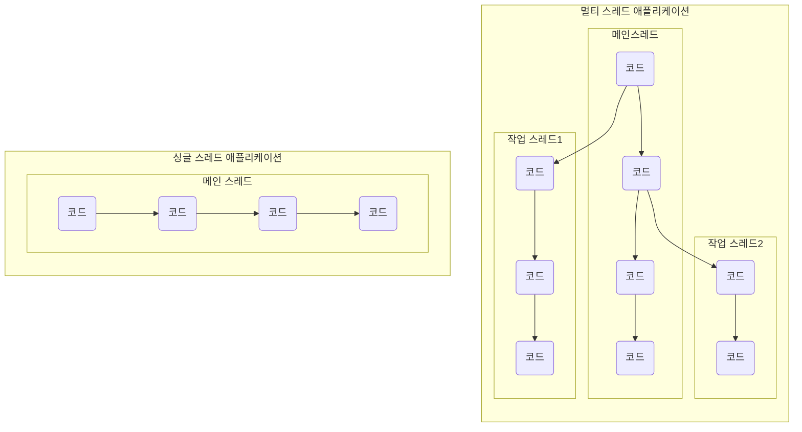
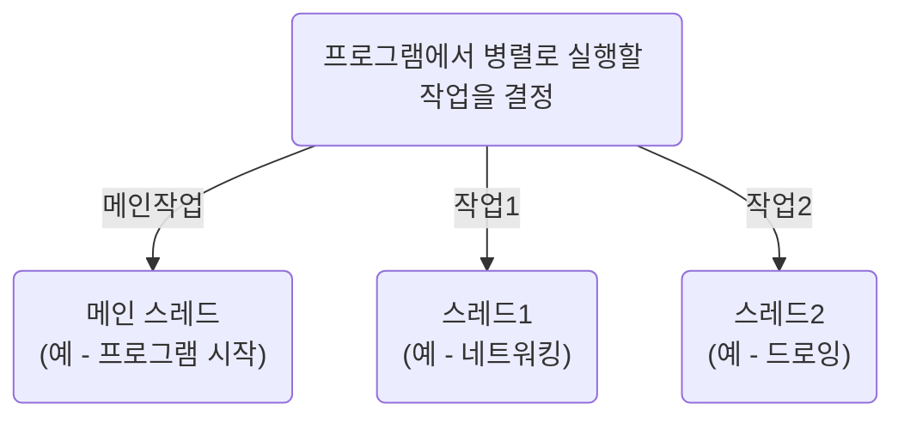
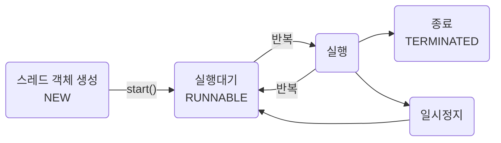
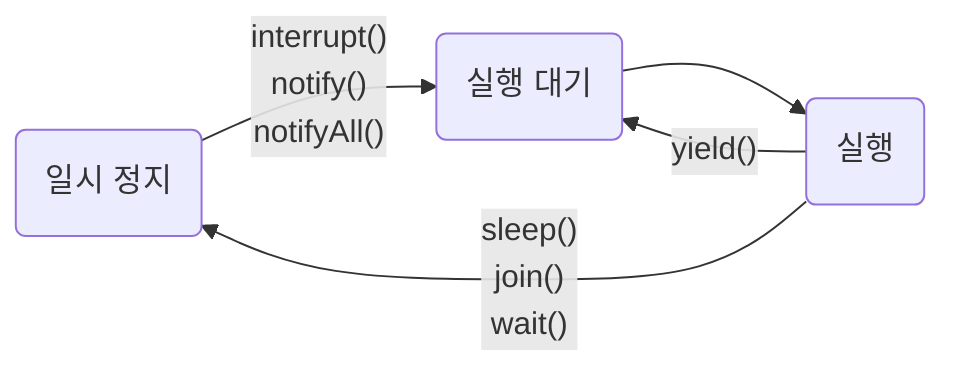
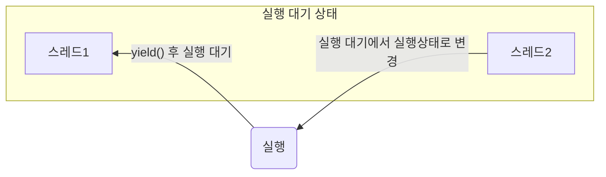
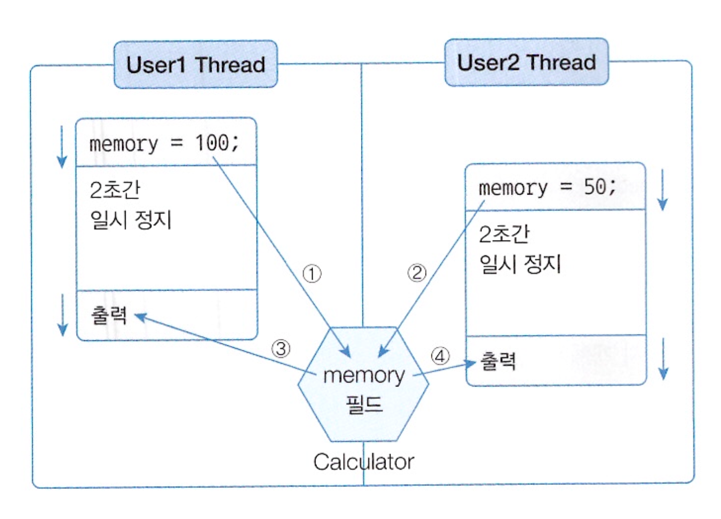
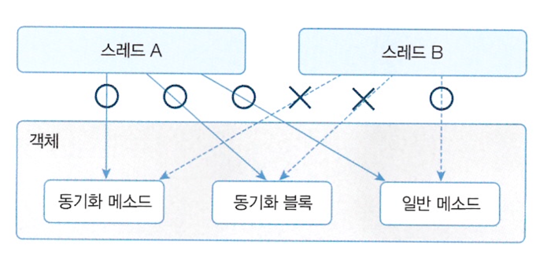
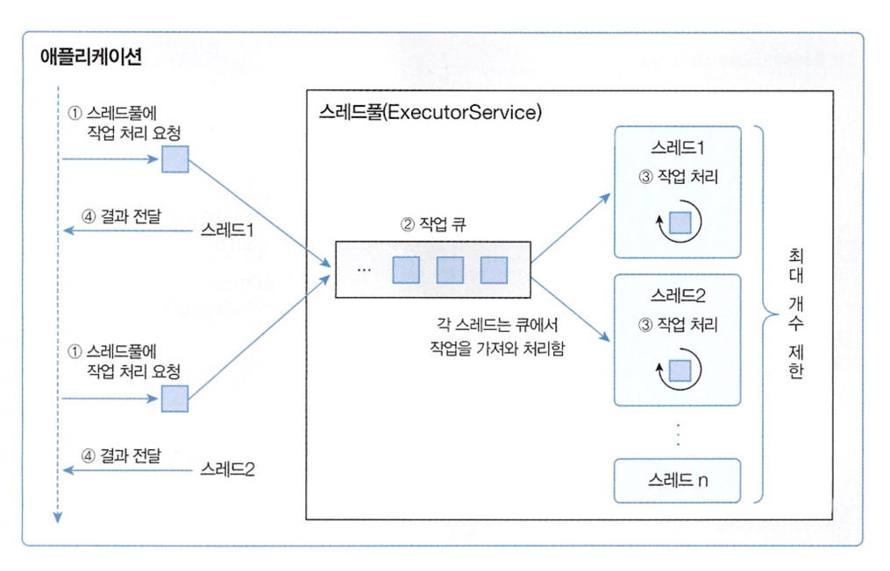

# Part 03 라이브러리 활용
## Chapter 14 멀티 스레드
### [14.1 멀티 스레드 개념](#-141-멀티-스레드-개념)
### [14.2 메인 스레드](#-142-메인-스레드)
### [14.3 작업 스레드 생성과 실행](#-143-작업-스레드-생성과-실행)
### [14.4 스레드 이름](#-144-스레드-이름)
### [14.5 스레드 상태](#-145-스레드-상태)
### [14.6 스레드 동기화](#-146-스레드-동기화)
### [14.7 스레드 안전 종료](#-147-스레드-안전-종료)
### [14.8 데몬 스레드](#-148-데몬-스레드)
### [14.9 스레드풀](#-149-스레드풀)


## 🔖 14.1 멀티 스레드 개념
운영체재는 실행 중인 프로그램을 프로세스<sup>process</sup>로 관리한다. 멀티 태스킹<sup>multi tasking</sup>은 두 가지 이상의 작업을 동시에 처리하는 것을 말하는데, 이때 운영체재는 멀티 프로세스를 생성해서 처리 (but, 밀티 태스킹이 꼭 멀티 프로세스를 뜻하진 않음)  
- 멀티 스레드<sup>multi thread</sup>
  - 하나의 프로세스가 두가지 이상의 작업을 처리할 수 있는 코드 실행 흐름
  - 멀티 프로세스가 프로그램 단위의 멀티 태스킹이라면 스레드는 프로그램 내부에서 멀티 태스킹이라고 봄
  - 멀티 스레드는 프로세스 내부에서 생성되기 때문에 하나의 스레드가 예외를 발생시키면 프로세스가 종료되므로 다른 스레드에게 영향을 미침
- 멀티 프로세스<sup>multi process</sup>
  - 서로 독립적으로 하나의 프로세스에서 오류가 발생해도 다른 프로세스에게 영향을 미치지 않음
  - 워드와 엑셀을 동시에 사용한다면 멀티 프로세스로 동작하기 때문에 워드가 에러로 종료되더라도 엑셀은 사용할 수 있음


## 🔖 14.2 메인 스레드
모든 자바 프로그램은 메인 스레드<sup>main thread</sup>가 main() 메소드를 실행하면서 시작  
메인 스레드는 main() 메소드의 첫 코드부터 순차적으로 실행하고, main() 메소드의 마지막 코드를 실행하거나 return 문을 만나면 실행을 종료
```java
public static void main(String[] args) {
    String data = null;
    if (...) {
    }
    while(...) {
    }
    System.out.println("...");
}
```
메인 스레드는 필요에 따라 추가 작업 스레드들을 만들어서 실행시킬 수 있음.

싱글 스레드에서는 메인 스레드가 종료되면 프로세스도 종료되지만 멀티 스레드에서는 실행 중인 스레드가 하나라도 있다면 프로세스는 종료되지 않는다. 
- 메인이 종료되더라도 작업 스레드가 실행중이라면 프로세스는 종료되지 않는다.


## 🔖 14.3 작업 스레드 생성과 실행
멀티 스레드로 실행하는 프로그램을 개발하려면 먼저 몇개의 작업을 병렬로 실행할지 결정하고 각 작업별로 스레드를 생성해야 함

자바 프로그램은 메인 스레드가 반드시 존재하기 때문에 메인 작업 이외의 추가적인 작업 수만큼 스레드를 생성  
(Thread 클래스로 직접 객체를 생성하거나 하위 클래스를 만들어 생성 가능)

### Thread 클래스로 직접 생성
Runnable 의 run 메소드를 재정의해서 스레드가 실행할 코드를 작성하고 Thread 생성자 호출 시 매개값으로 사용할 수 있다.  
이 후 start() 메소드를 통해 스레드를 실행 가능
```java
Runnable task = new Task();
Thread thread = new Thread(task);
thread.start();
```
```java
class Task implements Runnable {
    @Override
    public void run() {
        //스레드가 실행할 코드
    }
}
```
목적에 맞게 비프음 0.5초 간격 발생 및 동시에 프린팅을 하고 싶다면 두 작업 스레드를 하나에서 처리하도록 변경해야 함 (비프음 5번 발생 이후 출력값 띵 5번 출력됨)
```java
package temp.src.ch14.sec03.exam01;

import java.awt.Toolkit;

public class BeepPrintExample {
    public static void main(String[] args) {
        Toolkit toolkit = Toolkit.getDefaultToolkit();
        for(int i=0; i<5; i++) {
            toolkit.beep();
            try { Thread.sleep(500); } catch (Exception e) {}
        }

        for(int i=0; i<5; i++) {
            System.out.println("띵");
            try { Thread.sleep(500); } catch (Exception e) {}
        }
    }
}
```
```shell
#실행결과
띵
띵
띵
띵
띵
```
아래와 같이 변경 시 작업 스레드에서 작업 정의 후 메인스레드와 동시에 처리가 가능함
```java
package temp.src.ch14.sec03.exam02;

import java.awt.*;

public class BeepPrintExample {
    public static void main(String[] args) {
        Thread thread = new Thread(new Runnable() {
            @Override
            public void run() {
                Toolkit toolkit = Toolkit.getDefaultToolkit();
                for(int i=0; i<5; i++) {
                    toolkit.beep();
                    try { Thread.sleep(500); } catch (Exception e) {}
                }
            }
        });

        thread.start();

        for(int i=0; i<5; i++) {
            System.out.println("띵");
            try { Thread.sleep(500); } catch (Exception e) {}
        }
    }
}
```
### Thread 자식 클래스로 생성
자식 클래스 대신 익명클래스를 많이 쓰고 아래 예제와 같이 사용할 수 있음
```java
package temp.src.ch14.sec03.exam03;

import java.awt.*;

public class BeepPrintExample {
    public static void main(String[] args) {
        Thread thread = new Thread() {
            @Override
            public void run() {
                Toolkit toolkit = Toolkit.getDefaultToolkit();
                for(int i=0; i<5; i++) {
                    toolkit.beep();
                    try { Thread.sleep(500); } catch (Exception e) {}
                }
            }
        };

        thread.start();

        for(int i=0; i<5; i++) {
            System.out.println("띵");
            try { Thread.sleep(500); } catch (Exception e) {}
        }
    }
}
```

## 🔖 14.4 스레드 이름
스레드는 자신의 이름을 가지고 있고 메인 스레드는 'main' 이라는 이름을 가지고 있음.  
작업 스레드는 자동적으로 'Thread-n' 이라고 부여됨.  
직접 설정 시 아래와 같이 Thread 클래스의 setName() 메소드 이용
```java
thread.setName("스레드 이름");
```
스레드 이름은 디버깅할때 어떤 스레드가 작업을 하는지 조사할 목적으로 주로 사용  
현재 코드를 어떤 스레드가 실행하고 있는지 확인하려면 정적 메소드 currentThread*()로 스레드 객체의 참조를 얻은 다음 getName() 메소드로 이름 확인 가능
```java
Thread thread = Thread.currentThread();
System.out.println(thread.getName());
```
### p601. ThreadNameExample.java
```java
package temp.src.ch14.sec04;

public class ThreadNameExample {
    public static void main(String[] args) {
        Thread mainThread = Thread.currentThread();
        System.out.println(mainThread.getName() + " 실행");

        for(int i=0; i<3; i++) {
            Thread threadA = new Thread() {
                @Override
                public void run() {
                    System.out.println(getName() + " 실행");
                }
            };
            threadA.start();
        }

        Thread chatThread = new Thread() {
            @Override
            public void run() {
                System.out.println(getName() + " 실행");
            }
        };
        chatThread.setName("chat-thread");
        chatThread.start();
    }
}
```
```shell
#실행결과
main 실행
Thread-1 실행
Thread-2 실행
Thread-0 실행
chat-thread 실행
```

## 🔖 14.5 스레드 상태

실행 상태에서 일시 정지 상태로 가기도 하는데 일시 정지 상태는 스레드가 실행할 수 없는 상태.  
스레드가 다시 실행 상태로 가기 위해서 는 일시 정지 상태에서 실행 대기 상태로 가야만 함.

<table>
  <thead>
    <tr>
      <th>구분</th>
      <th>메소드</th>
      <th>설명</th>
    </tr>
  </thead>
  <tbody>
    <tr>
      <td rowspan="3">일시정지로 보냄</td>
      <td>sleep(long millis)</td>
      <td>주어진 시간 동안 스레드를 일시 정지 상태로 만든다,<br>주어진 시간이 지나면 자동적으로 실행 대기 상태가 된다.</td>
    </tr>
    <tr>
      <td>join()</td>
      <td>join() 메소드를 호출한 스레드는 일시 정지 상태가 된다.<br>실행 대기 상태가 되려면, join() 메소드를 가진 스레드가 종료되어야 한다.</td>
    </tr>
    <tr>
      <td>wait()</td>
      <td>동기화 블록 내에서 스레드를 일시 정지 상태로 만든다.</td>
    </tr>
    <tr>
      <td rowspan="2">일시정지에서 벗어남</td>
      <td>interrupt()</td>
      <td>일시 정지 상태일 경우,<br>InterruptedException을 발생시켜 실행 대기 상태 또는 종료 상태로 만든다.</td>
    </tr>
    <tr>
      <td>notify()<br>notifyAll()</td>
      <td>wait() 메소드로 인해 일시 정지 상태인 스레드를 실행 대기 상태로 만든다.</td>
    </tr>
    <tr>
      <td>실행 대기로 보냄</td>
      <td>yield()</td>
      <td>실행 상태에서 다른 스레드에게 실행을 양보하고 실행 대기 상태가 된다.</td>
    </tr>
  </tbody>
</table>

### 주어진 시간 동안 일시 정지
일시 정지 상태에서는 InterruptedException 이 발생할 수 있기 때문에 sleep() 은 예외 처리가 필요한 메소드이다.
```java
try {
    Thread.sleep(1000);
} catch(InterruptedException e) {
    // interrupt() 메소드가 호출되면 실행
}
```

### 다른 스레드의 종료를 기다림
스레드는 다른 스레드와 독립적으로 실행하지만 다른 스레드가 종료될 때까지 기다렸다가 실행을 해야 하는 경우도 있다 이를 위해 스레드는 join() 메소드를 제공한다.
```java
package temp.src.ch14.sec05.exam02;

public class SumThread extends Thread {
    private long sum;

    public long getSum() {
        return sum;
    }

    public void setSum(long sum) {
        this.sum = sum;
    }

    @Override
    public void run() {
        for(int i=1; i<=100; i++) {
            sum+=i;
        }
    }
}
```

```java
package temp.src.ch14.sec05.exam02;

public class JoinExample {
  public static void main(String[] args) {
    SumThread sumThread = new SumThread();
    sumThread.start();
    try {
      sumThread.join();
    } catch (InterruptedException e) {
    }

    System.out.println("1~100 합: " + sumThread.getSum());
  }
}
```
```shell
#실행결과
1~100 합: 5050
```

### 다른 스레드에게 실행 양보
스레드가 처리하는 작업은 반복적인 실행을 위해 for 문이나 while 문을 포함하는 경우가 많은데, 가끔 반복문이 무의미한 반복을 하는 경우가 있는데 이때는 다른 스레드에게 실행을 양보하고 자신은 실행 대기 상태로 가는 것이 프로그램 성능에 도움이 된다. 이런 기능을 위해 Thread는 yield() 메소드를 제공한다.

#### p607. YieldExample.java 예재
```java
package temp.src.ch14.sec05.exam03;

public class WorkThread extends Thread {
    public boolean work = true;

    public WorkThread(String name) {
        setName(name);
    }

    @Override
    public void run() {
        while(true) {
            if (work) {
                System.out.println(getName() + ": 작업처리");
            } else {
                Thread.yield();
            }
        }
    }
}
```
```java
package temp.src.ch14.sec05.exam03;

public class YieldExample {
    public static void main(String[] args) {
        WorkThread workThreadA = new WorkThread("workThreadA");
        WorkThread workThreadB = new WorkThread("workThreadB");
        workThreadA.start();
        workThreadB.start();

        try { Thread.sleep(5000); } catch (InterruptedException e) {}
        workThreadA.work = false;

        try { Thread.sleep(10000); } catch (InterruptedException e) {}
        workThreadA.work = true;
    }
}
```
```shell
#실행결과
workThreadA: 작업처리
...
workThreadB: 작업처리
...
workThreadB: 작업처리
workThreadB: 작업처리
workThreadB: 작업처리
...
workThreadA: 작업처리
...
workThreadB: 작업처리
...
```


## 🔖 14.6 스레드 동기화
멀티 스레드는 하나의 객체를 공유해서 작업할 수 있다. 이 경우, 다른 스레드에 의해 객체 내부 데이터가 쉽게 변경될 수 있기 때문에 의도했던 것과는 다른 결과가 나올 수 있다.
  
UserThread 는 Calculator 객체의 memory 필드에 100을 먼저 저장하고 2초간 일시 정지 상태가 된다. 그동안 User2Thread가 memory 필드값을 50으로 변경한다. 2초가 지나 User1Thread 가 다시 실행 상태가 되어 memory 필드의 값을 출력하면 User2Thread가 저장한 50이 나온다.
> 스레드가 사용 중인 객체를 다른 스레드가 변경할 수 없도록 하려면 스레드 작업이 끝날 때까지 잠금을 검면 된다. 이를 위해 자바는 동기화<sup>synchronized</sup> 메소드와 블록을 제공  


* 객체 내부에 동기화 메소드와 동기화 블록이 여러 개가 있다면 스레드가 이들 중 하나를 실행할 때 다른 스레드는 해당 메소드는 물론이고 다른 동기화 메소드 및 블록도 실행할 수 없다. 하지만 일반 메소드는 실행이 가능하다.

### 동기화 메소드 및 블록 선언
동기화 메소드를 선언하는 방법은 synchronized 키워드를 붙이면 된다.  
키워드는 인스턴스와 정적 메소드 어디든 붙일 수 있다.
```java
public synchronized void method() {
    //단 하나의 스레드만 실행하는 영역
}
```
메소드 전체가 아닌 일부 영역을 실행할 때만 객체 잠금을 걸고 싶다면 다음과 같이 동기화 불록ㅇ들 만들면 된다.
```java
public void method() {
    //여러 스레드가 실행할 수 있는 영역
    synchronized(공유객체) {
        //단 하나의 스레드만 실행하는 영역
    }

    //여러 스레드가 실행할 수 있는 영역
}
```
### p611. SynchronizedExample.java 동기화 메소드 예제
```java
package temp.src.ch14.sec06.exam01;

public class Calculator {
    private int memory;

    public int getMemory() {
        return memory;
    }

    public synchronized void setMemory1(int memory) {
        this.memory = memory;
        try {
            Thread.sleep(2000);
        } catch (InterruptedException e) {}
        System.out.println(Thread.currentThread().getName() + ": " + this.memory);
    }

    public void setMemory2(int memory) {
        synchronized (this) {
            this.memory = memory;
            try {
                Thread.sleep(2000);
            } catch (InterruptedException e) {
            }
            System.out.println(Thread.currentThread().getName() + ": " + this.memory);
        }
    }
}
```
```java
package temp.src.ch14.sec06.exam01;

public class User1Thread extends Thread {
    private Calculator calculator;

    public User1Thread() {
        setName("User1Thread");
    }

    public void setCalculator(Calculator calculator) {
        this.calculator = calculator;
    }

    @Override
    public void run() {
        calculator.setMemory1(100);
    }
}
```
```java
package temp.src.ch14.sec06.exam01;

public class User2Thread extends Thread {
    private Calculator calculator;

    public User2Thread() {
        setName("User2Thread");
    }

    public void setCalculator(Calculator calculator) {
        this.calculator = calculator;
    }

    @Override
    public void run() {
        calculator.setMemory2(50);
    }
}
```
```java
package temp.src.ch14.sec06.exam01;

public class SynchronizedExample {
    public static void main(String[] args) {
        Calculator calculator = new Calculator();

        User1Thread user1Thread = new User1Thread();
        user1Thread.setCalculator(calculator);
        user1Thread.start();

        User2Thread user2Thread = new User2Thread();
        user2Thread.setCalculator(calculator);
        user2Thread.start();
    }
}
```
```shell
#실행결과
User1Thread: 100
User2Thread: 50
```

### wait()와 notify()를 이용한 스레드 제어
경우에 따라서는 두 개의 스레드를 교대로 번갈아 가며 실행할 때도 있다. 정확한 교대 작업이 필요할 경우, 자신의 작업이 끝나면 상대방 스레드를 일시 정지 상태에서 풀어주고 자신은 일시 정지 상태로 만들면 된다.
- 공유 객체는 두 스레드가 작업할 내용을 각각 동기화 메소드로 정해 놓는다. 한 스레드가 작업을 완료하면 notify() 메소드를 호출해서 일시 정지 상태에 있는 다른 스레드를 실행 대기 상태로 만들고 자신은 두 번 작업을 하지 않도록 wait() 메소드를 호출하여 일시 정지 상태로 만든다.

## 🔖 14.7 스레드 안전 종료
스레드는 자신의 run() 메소드가 모두 실행되면 자동적으로 종료되지만 경우에 따라서는 실행 중인 스레드를 즉시 종료할 필요가 있다. 예를 들어 동영상을 끝까지 보지 않고 사용자가 멈춤을 요구 하는 경우 스레드를 강제 종료 시키기 위해 Thread는 stop() 메소드를 제공하고 있으나 이 메소드는 deprecated(더 이상 사용하지 않음) 되었다.

### 조건 이용
```java
public class XXXThread extends Thread {
    private boolean stop;
    
    public void run() {
        while( !stop ) {
            //스레드가 반복 실행하는 코드
        }
        //스레드가 사용한 리소스 정리
    }
}
```
### Interrupt 메소드 이용
```java
package temp.src.ch14.sec07.exam02;

public class PrintThread extends Thread {
    @Override
    public void run() {
        try {
            while (true) {
                System.out.println("실행 중");
                Thread.sleep(1);
            }
        } catch (InterruptedException e) {
        }
        System.out.println("리소스 정리");
        System.out.println("실행 종료");
    }
}
```
```java
package temp.src.ch14.sec07.exam02;

public class InterruptExample {
    public static void main(String[] args) {
        Thread thread = new PrintThread();
        thread.start();

        try {
            Thread.sleep(1000);
        } catch (InterruptedException e) {
        }

        thread.interrupt();
    }
}
```
```shell
#실행결과
...
실행 중
실행 중
실행 중
리소스 정리
실행 종료
```


## 🔖 14.8 데몬 스레드
데몬 스레드는 주 스레드의 작업을 돕는 보조적인 역할을 수행하는 스레드  
주 스레드가 종료되면 데몬 스레드도 따라서 종료
스레드를 데몬으로 만들기 위해 주 스레드가 데몬이 될 스레드의 setDaemon(true)를 호출하면 된다.
````java
public static void main(String[] args) {
    AutoSaveThread thread = new AutoSaveThread();
    thread.setDaemon(true);
    thread.start();
    ...
}
````

## 🔖 14.9 스레드풀
병렬 작업 처리가 많아지면 스레드의 개수가 폭증하여 CPU가 바빠지고 메모리 사용량이 늘어난다. 이예 따라 애플리케이션의 성능 또한 급격히 저하되고 이렇게 병렬 작업 증가로 인한 스레드의 폭증을 막으려면 스레드풀<sup>ThreadPool</sup>을 사용하는 것이 좋다.  
스레드풀은 작업 처리에 사용되는 스레드를 제한된 개수만큼 정해놓고 작업 큐<sup>Queue</sup>에 들어오는 작업들을 스레드가 하나씩 맡아 처리하는 방식 (작업량이 증가해도 한정된 최대 스레드 개수가 있어 애플리케이션 성능이 급격히 저하되지 않는다.)


### 스레드풀 생성
java.util.concurrent 패키지에서 ExecutorService 인터페이스와 Executors 클래스를 제공

| 메소드명(매개변수)                       | 초기 수 | 코어 수  | 최대 수              |
|----------------------------------|------|-------|-------------------|
| newCachedThreadPool()            | 0    | 0     | Integer.MAX_VALUE |
| newFixedThreadPool(int nThreads) | 0    | 생성된 수 | nThreads          |
```java
ExecutorService threadPool = new ThreadPoolExecutor(
    3,                                  //코어 스레드 개수
    100,                                //최대 스레드 개수
    120L,                               //놀고 있는 시간
    TimeUnit.SECONDS,                   //놀고 있는 시간 단위
    new SynchronounsQueue<Runnable>{}   //작업 큐
);
```

### 스레드풀 종료
| 리턴 타입            | 메소드명(매개변수)    | 설명                                                                                         |
|------------------|---------------|--------------------------------------------------------------------------------------------|
| void             | shutdown() | 현재 처리 중인 작업뿐만 아니라 작업 큐에 대기하고 있는 모든 작업을 처리한 뒤에 스레드풀을 종료시킨다.                                 |
| List\<Runnable\> | shutdownNow() | 현재 작업 처리 중인 스레드를 interrupt해서 작업을 중지시키고 스레드풀을 종료시킨다. 리턴값은 작업 큐에 있는 미처리된 작업(Runnable)의 목록이다. |

### 작업 생성과 처리 요청
하나의 작업은 Runnable 또는 Callable 구ㅜ현 객체로 표현  
Runnable과 Callable 차이점
- 작업 완료 후 리턴값이 있느냐 없느냐

|Runnable 익명 구현 객체|Callable 익명 구현 객체|
|--|--|
|new Runnable() {<br>&nbsp; &nbsp; @Override<br>&nbsp; &nbsp; Public void run() {<br>&nbsp; &nbsp; &nbsp; &nbsp; //스레드가 처리할 작업 내용<br>&nbsp; &nbsp; }<br>}|new Callable\<T\>() {<br>&nbsp; &nbsp; @Override<br>&nbsp; &nbsp; Public T call() throws Exception {<br>&nbsp; &nbsp; &nbsp; &nbsp; //스레드가 처리할 작업 내용<br>&nbsp; &nbsp; &nbsp; &nbsp; return T;<br>&nbsp; &nbsp; }<br>}

| 리턴 타입       | 메소드명(매개변수)                 | 설명                                                              |
|-------------|----------------------------|-----------------------------------------------------------------|
| void        | execute(Runnable command)  | - Runnable을 작업 큐에 저장<br> - 작업 처리 결과를 리턴하지 않음                    |
| Future\<T\> | submit(Callable\<T\> task) | - Callable을 작업 큐에 저장<br> - 작업 처리 결과를 얻을 수 있도록 Future를 리턴 |

### p629. RunnableExecuteExample.java 예재
```java

```